# **A Cryptographic Framework for Medical Data Confidentiality: Design, Implementation, and Post-Quantum Analysis for the Sheikh Zayed Foundation**

**A Thesis Presented for the Degree of Master of Science in Computer Science**

**Author:** Jarmouni Rachid
**Academic Supervisor:** Prof. Mohamed Naoum
**Professional Supervisor:** Mr. Anouar Bouchal

**Defense Jury:**
**President:** Prof. Adil Anwar
**Examiner:** Prof. Mourad El Yadari
**Supervisor:** Prof. Mohamed Naoum


**Academic Year:** 2024-2025

---

## **Abstract**

This report presents a comprehensive framework for securing sensitive medical data at the Sheikh Zayed Foundation. The work follows the IMRaD (Introduction, Methods, Results, and Discussion) model to design, implement, and analyze a robust cryptographic security architecture. The primary contribution is the architectural synthesis of advanced cryptographic techniques into a coherent, practical, and future-proof system. We detail the **Methods** used to design a centralized security framework centered around Application-Level Encryption (ALE) with a dedicated Key Management System (KMS) and advanced searchable symmetric encryption (SSE). We then conduct a formal **Threat Modeling** analysis of the architecture using the STRIDE methodology to validate its security claims. The **Results** section demonstrates the successful verification of the implemented framework, presenting performance metrics and validating the efficacy of role-based access control. The **Discussion** critically analyzes performance trade-offs, explores the ethical implications of cryptographic leakage, and proposes a framework for **Cryptographic Governance**. Finally, we provide a strategic outlook on future-proofing the system by migrating to **Post-Quantum Cryptography (PQC)**. This work provides a robust, research-backed cryptographic framework that serves as a technical foundation for achieving compliance with Moroccan data protection legislation while maintaining operational efficiency and ethical integrity.

**Keywords:** Cryptography, Key Management System (KMS), Application-Level Encryption (ALE), Searchable Symmetric Encryption (SSE), Post-Quantum Cryptography (PQC), Threat Modeling, STRIDE, Data Security, Medical Data, Envelope Encryption, HashiCorp Vault, Keycloak, Access Control, Healthcare Security, Leakage Analysis, Crypto-Agility, Cryptographic Governance.

---


---

## **Résumé**

Ce mémoire présente un cadre complet pour la sécurisation des données médicales sensibles au sein de la Fondation Sheikh Zayed. Le travail s'appuie sur le modèle IMRaD (Introduction, Méthodes, Résultats et Discussion) pour concevoir, mettre en œuvre et analyser une architecture de sécurité cryptographique robuste. La contribution principale réside dans la synthèse architecturale de techniques cryptographiques avancées en un système cohérent, pratique et pérenne.

Nous détaillons les **Méthodes** employées pour concevoir un cadre de sécurité centralisé, articulé autour du chiffrement au niveau applicatif (ALE), d'un système de gestion de clés (KMS) dédié, et du chiffrement symétrique interrogeable (SSE) avancé. Une analyse formelle par **modélisation des menaces** (Threat Modeling) selon la méthodologie STRIDE est ensuite menée pour valider les postulats de sécurité de l'architecture. La section **Résultats** démontre la vérification réussie du cadre implémenté, en présentant des métriques de performance et en validant l'efficacité du contrôle d'accès basé sur les rôles. La **Discussion** procède à une analyse critique des compromis de performance, explore les implications éthiques des fuites cryptographiques et propose un cadre de **gouvernance cryptographique**. Enfin, nous offrons une perspective stratégique pour la pérennisation du système à travers une migration vers la **cryptographie post-quantique (PQC)**.

Ce travail fournit un cadre cryptographique robuste, fondé sur la recherche, servant de socle technique pour atteindre la conformité avec la législation marocaine sur la protection des données, tout en préservant l'efficacité opérationnelle et l'intégrité éthique.

**Mots-clés :** Cryptographie, Système de Gestion de Clés (KMS), Chiffrement au Niveau Applicatif (ALE), Chiffrement Symétrique Interrogeable (SSE), Cryptographie Post-Quantique (PQC), Modélisation des Menaces, STRIDE, Sécurité des Données, Données Médicales, Chiffrement Enveloppe, HashiCorp Vault, Keycloak, Contrôle d'Accès, Sécurité des Soins de Santé, Analyse des Fuites, Crypto-Agilité, Gouvernance Cryptographique.

---

## **Gratitude**

To my dearest parents,

It is thanks to your love, your immense affection, your encouragement, the trust you placed in me, and your countless sacrifices that I have reached the end of this work today. I hope you will find in this modest work the fruit of your sacrifices as well as the expression of my deep affection and gratitude. May God protect and keep you.

To all my friends, whom I cannot name individually, I thank you enormously for your support and encouragement.

To all my professors, for their sacred efforts to ensure we received an excellent education. I hope that this report will satisfy anyone who has the opportunity to read it.

---

## **Acknowledgments**

The completion of this Final Year Project marks the culmination of an intense and enriching period of work. It would not have been possible without the support and guidance of several people, to whom I wish to express my deepest gratitude.

First and foremost, I wish to express my sincere gratitude to the entire **Sheikh Zayed Foundation** for offering me the opportunity to carry out my research within their esteemed organization. I am particularly grateful for the access to invaluable institutional documents and the real-world operational context that formed the bedrock of this research on medical data security and cryptographic protection.

A special and profound thank you goes to my professional supervisor, **Mr. Anouar Bouchal**. His invaluable industry expertise, daily guidance, and unwavering availability were instrumental in navigating the complexities of the cryptographic security framework project. I am grateful for the trust he placed in me and for the enriching professional environment he fostered.

My gratitude extends equally to my academic supervisor, **Prof. Mohamed Naoum**, for his rigorous scientific oversight, insightful advice, and constructive feedback, which significantly improved the quality and structure of this thesis. His pedagogical approach and intellectual guidance were essential throughout this research on advanced cryptographic techniques and healthcare data protection.

I would also like to extend my appreciation to the members of my defense jury: **Prof. Adil Anwar**, President of the Jury; **Prof. Mourad El Yadari**, Examiner; and my supervisor, **Prof. Mohamed Naoum**, for the honor they have done me by accepting to evaluate this work and for the time they dedicated to its review.

---

### **List of Figures**

*   Figure 2.1: Regulatory Landscape and Technical Response
*   Figure 2.2: High-Level Approaches to Search over Encrypted Data
*   Figure 3.1: High-Level System Architecture
*   Figure 3.2: KMS Architecture with Vault and Keycloak
*   Figure 3.3: Key Hierarchy and Envelope Encryption
*   Figure 3.4: Sequence Diagram for File Encryption and Decryption
*   Figure 3.5: Sequence Diagram for Database Column Encryption
*   Figure 3.6: Role-Based Data Masking Flow
*   Figure 5.1: End-to-End Decryption Workflow Verification
*   Figure 6.1: Functional Architecture of a Searchable Encryption Scheme
*   Figure 6.2: AI-Enhanced KMS Architecture
*   Figure 6.3: Discussion Summary Mind Map
*   Figure 8.1: The "Harvest Now, Decrypt Later" PQC Threat Timeline
*   Figure 8.2: NIST PQC Standardization Timeline
*   Figure 8.3: Crypto-Agile KMS Architecture
*   Figure 9.1: Phased Implementation and Future Research Roadmap

### **List of Tables**

*   Table 2.1: Feature and Security Comparison of Advanced Cryptographic Schemes
*   Table 2.2: Comparative Analysis of Dynamic SSE Schemes with Privacy Definitions
*   Table 5.1: Proof-of-Concept Performance Metrics for Cryptographic Operations
*   Table 6.1: Estimated Performance of ODXT for a 1 Million Record Database
*   Table 8.1: NIST PQC Standardized Algorithms
*   Table 8.2: Impact of Quantum Algorithms on Classical Cryptography

---

---

### **Table of Contents**

**Abstract**
**Résumé**
**Gratitude**
**Acknowledgments**
**List of Figures**
**List of Tables**

---

### **Part I: Design and Implementation of a Cryptographic Security Framework**

**Chapter 1: General Introduction**
- 1.1 Context and Motivation
- 1.2 Problem Statement and Threat Model
- 1.3 Objectives and Scope
- 1.4 Report Structure

**Chapter 2: State of the Art and Problem Formulation**
- 2.1 Data Security Imperatives for the Sheikh Zayed Foundation
- 2.2 Regulatory Framework for Data Protection in Morocco (Laws 09-08 & 05-20)
- 2.3 Foundational and Advanced Cryptographic Primitives
    - 2.3.1 Symmetric and Asymmetric Encryption
    - 2.3.2 The Challenge of Searching and Computing on Encrypted Data
    - 2.3.3 The Inevitable Leakage of Practical SSE
- 2.4 Problem Formulation and Chosen Approach

**Chapter 3: Materials and Methods: System Design and Architecture**
- 3.1 Overall System Architecture
- 3.2 Key Management System (KMS) Design
    - 3.2.1 Technological Choices (Vault, Keycloak)
    - 3.2.2 Key Hierarchy and Envelope Encryption
- 3.3 Cryptographic Application Strategies (At Rest, In Use)
- 3.4 Implementation Blueprints
    - 3.4.1 Envelope Encryption Workflow Logic
    - 3.4.2 Access Control Policy Definition
- 3.5 Comparison with Alternative Encryption Strategies

**Chapter 4: Threat Modeling and Security Analysis**
- 4.1 Methodology: STRIDE
- 4.2 Threat Analysis and Mitigations
    - 4.2.1 Spoofing
    - 4.2.2 Tampering
    - 4.2.3 Repudiation
    - 4.2.4 Information Disclosure
    - 4.2.5 Denial of Service (DoS)
    - 4.2.6 Elevation of Privilege

**Chapter 5: Results: Verification and Analysis of the Implemented Framework**
- 5.1 Verification of the End-to-End Workflow
- 5.2 Performance Benchmarks of Core Operations
- 5.3 Validation of Access Control Policies

**Chapter 6: Discussion: Analysis and Future Enhancements**
- 6.1 Analysis of the Implemented Security Framework
- 6.2 Addressing the Secure Search Problem: A Deeper Dive
    - 6.2.1 Case Study: Oblivious Dynamic Cross-Tags (ODXT)
    - 6.2.2 Integration of SSE with the KMS
- 6.3 Emerging Technologies and Future Directions
- 6.4 Limitations and Future Work
- 6.5 Ethical Implications and Responsible Implementation

**Chapter 7: Cryptographic Governance and Operations**
- 7.1 The Need for a Governance Framework
- 7.2 Key Management Lifecycle and Ceremonies
- 7.3 Cryptographic Incident Response Plan
- 7.4 Roles and Responsibilities

---

### **Part II: Future-Proofing the Framework**

**Chapter 8: Future Risk Analysis: Architecting for the Post-Quantum Era**
- 8.1 Introduction: The "Harvest Now, Decrypt Later" Imperative
    - 8.1.1 The Inevitability of the Quantum Threat
    - 8.1.2 Vulnerability of Long-Lived Data in the Foundation's Context
- 8.2 The Quantum Adversary and the NIST PQC Response
    - 8.2.1 Review of Shor's and Grover's Algorithms
    - 8.2.2 Overview of the NIST Post-Quantum Cryptography Standardization Process
    - 8.2.3 The New Toolkit: ML-KEM, ML-DSA, and Alternatives
- 8.3 Impact on the Designed Framework
- 8.4 Crypto-Agility as the Core Mitigation Strategy
    - 8.4.1 The Role of the KMS as the Engine of Transition
    - 8.4.2 Why a Zero Trust Architecture Is a Prerequisite for PQC Migration
- 8.5 Synthesizing Architectural Requirements for a Quantum-Resistant Framework

**Chapter 9: General Conclusion**
- 9.1 Summary of Achievements
- 9.2 Critical Assessment and Limitations
- 9.3 Personal and Professional Contributions
- 9.4 Future Prospects and Implementation Plan

---

**Glossary**

**Appendices**
- Appendix A: Proof of Concept: Homomorphic Encryption Implementation
- Appendix B: Proof of Concept: ODXT Implementation
- Appendix C: KMS Proof-of-Concept: Environment, Configuration, and Verification

**Bibliography**


---

## **Chapter 1: General Introduction**

### 1.1 Context and Motivation

The digital transformation of the healthcare sector has brought unprecedented efficiencies and capabilities in patient care, medical research, and administration. However, this digitization comes with a profound responsibility: the safeguarding of highly sensitive data assets. The **Sheikh Zayed Foundation (SZF)**, a prominent non-profit organization headquartered in Rabat, Morocco, plays an integral role in advancing the nation's health sector. Its comprehensive mission encompasses medical care, teaching, research, and medical support for populations in difficulty. The Foundation's diverse operational footprint includes multiple healthcare facilities, a university campus, dedicated research centers (notably a genetic research center), and mobile care units.

This extensive network processes a wide array of sensitive data types daily, including Electronic Health Records (EHRs), detailed medical histories, genetic data, and pharmaceutical research findings. The presence of a specialized genetic research center significantly elevates the overall data security requirements for the Foundation, necessitating the highest level of privacy protection.

Standard security measures like firewalls are necessary but insufficient. Once an attacker breaches the perimeter, or an insider misuses their access, unencrypted data is fully exposed. Therefore, robust, data-centric security—where the data itself is protected through strong cryptography—is non-negotiable. This project addresses this critical need by proposing a comprehensive cryptographic framework designed not only to protect data at rest and in transit but also to enable its secure use and management throughout its entire lifecycle.

### 1.2 Problem Statement and Threat Model

The core challenge is to design a security system that provides end-to-end confidentiality and integrity for the diverse and highly sensitive data of the **Sheikh Zayed Foundation** without crippling performance. This challenge can be broken down into several key problems:

1.  **Secure Key Management:** The security of any encryption system is fundamentally dependent on the management of its cryptographic keys. A centralized, secure, and automated Key Management System (KMS) is required.
2.  **Search over Encrypted Data:** Encrypting the entire database protects it from bulk theft but prevents legitimate, efficient searching. A mechanism is needed to allow authorized users to perform queries on the data while it remains encrypted on the server.
3.  **Granular Access Control:** Different roles require access to different subsets of data. The system must enforce fine-grained, policy-based access control at the data level.
4.  **Operational Efficiency:** The proposed security framework must maintain high performance and usability.
5.  **Defining the Adversary:** A robust design requires a clearly defined threat model. For the scope of this thesis, we consider an **honest-but-curious server-side adversary**. This model assumes the server (e.g., a cloud provider or internal data center) will follow the protocol correctly but will simultaneously attempt to infer information from all data it holds (ciphertexts, encrypted indexes) and from observed communication patterns (queries, updates). We assume the client-side application and the KMS are in a trusted environment, but the database and file storage are not.

### 1.3 Objectives and Scope

The primary objective of this project is to design a state-of-the-art cryptographic security framework for the **Sheikh Zayed Foundation**. This includes:

*   Designing a robust Key Management System (KMS) architecture using HashiCorp Vault and Keycloak.
*   Developing a cryptographic strategy based on envelope encryption to protect data at rest.
*   Investigating and proposing a practical Searchable Symmetric Encryption (SSE) scheme to enable secure queries.
*   Providing a robust technical foundation for achieving compliance with Moroccan data protection legislation.
*   **Synthesizing these disparate fields (KMS, SSE, PQC) into a single, coherent, and practical architectural blueprint**, which stands as the primary contribution of this work.
*   Providing a strategic roadmap for future enhancements, including Post-Quantum Cryptography (PQC).

### 1.4 Report Structure

This report is structured to provide a comprehensive overview of the design, implementation, and future direction of a cryptographic security framework.

*   **Part I: Design and Implementation of a Cryptographic Security Framework** lays the groundwork for the project.
    *   **Chapter 1 (Introduction)** establishes the context, problem statement, and objectives.
    *   **Chapter 2 (State of the Art)** reviews the regulatory landscape, foundational cryptographic concepts, and the challenges of securing data in use.
    *   **Chapter 3 (Methods)** details the proposed system architecture, including the Key Management System design and specific cryptographic strategies.
    *   **Chapter 4 (Threat Modeling)** systematically analyzes the security of the design.
    *   **Chapter 5 (Results)** presents the verification and analysis of the proof-of-concept implementation.
    *   **Chapter 6 (Discussion)** analyzes the implemented framework, explores advanced capabilities, discusses ethical implications, and outlines limitations.
    *   **Chapter 7 (Cryptographic Governance)** outlines the essential operational procedures needed to manage the cryptographic system securely over its lifetime.
*   **Part II: Future-Proofing the Framework** focuses on long-term strategic considerations.
    *   **Chapter 8 (Future Risk Analysis)** provides a deep dive into the threat of quantum computing and outlines an architectural strategy for migrating to Post-Quantum Cryptography.
*   The report concludes with a **General Conclusion (Chapter 9)**, summarizing achievements, limitations, and future work, followed by a **Glossary**, **Appendices**, and a **Bibliography**.

---

## **Chapter 2: State of the Art and Problem Formulation**

### 2.1 Data Security Imperatives for the Sheikh Zayed Foundation

The **Sheikh Zayed Foundation (SZF)** operates across diverse and critical sectors, including healthcare, pharmaceutical activities, and university education. This multifaceted operational footprint means SZF manages an extensive array of highly sensitive data, ranging from Electronic Health Records (EHRs) and genetic information to pharmaceutical research findings and student Personally Identifiable Information (PII). The inherent sensitivity and diversity of this data necessitate a robust, multi-layered cryptographic strategy that ensures confidentiality, integrity, and availability without impeding operational efficiency.

### 2.2 Regulatory Framework for Data Protection in Morocco (Laws 09-08 & 05-20)

The Kingdom of Morocco has established a sophisticated legal framework that provides a clear mandate for the development of advanced, secure data management systems. This framework is principally defined by two key pieces of legislation: Law No. 09-08 on the protection of personal data and Law No. 05-20 on cybersecurity. Together, they create a compliance-driven imperative for the architecture proposed in this thesis.

When synthesized, these two laws do not merely suggest the need for security; they mandate a proactive, resilient, and privacy-preserving approach to data management. The system proposed in this thesis is therefore not just a technical exercise but a direct response to a legal and national strategic imperative, as summarized in Figure 2.1.

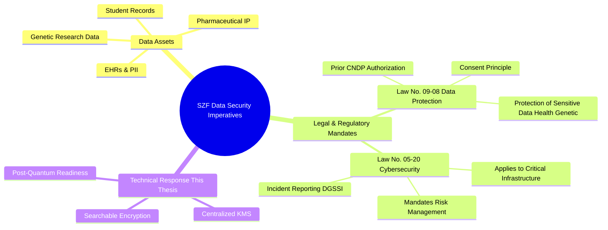
```mermaid
mindmap
  root((SZF Data Security Imperatives))
    Data Assets
      ::icon(fa fa-database)
      EHRs & PII
      Genetic Research Data
      Pharmaceutical IP
      Student Records
    Legal & Regulatory Mandates
      ::icon(fa fa-gavel)
      Law No. 09-08 Data Protection
        Prior CNDP Authorization
        Consent Principle
        Protection of Sensitive Data Health Genetic
      Law No. 05-20 Cybersecurity
        Applies to Critical Infrastructure
        Mandates Risk Management
        Incident Reporting DGSSI
    Technical Response This Thesis
      ::icon(fa fa-shield-alt)
      Centralized KMS
      Searchable Encryption
      Post-Quantum Readiness
```
**Figure 2.1: Regulatory Landscape and Technical Response**

### 2.3 Foundational and Advanced Cryptographic Primitives

The security of any data protection strategy rests upon the strength and appropriate application of cryptographic primitives. This section reviews both the foundational building blocks and the advanced schemes necessary to meet SZF's complex requirements.

#### 2.3.1 Symmetric and Asymmetric Encryption

The two foundational types of encryption can be understood through a simple metaphor:

> **Symmetric Encryption (e.g., AES):** Imagine a box locked with a specific key. The *same key* is needed to unlock it. This is very fast and efficient, but you must have a secure way to give the key to the person who needs to open the box.
>
> **Asymmetric Encryption (e.g., ECC):** Imagine a box that is locked using an open padlock (the "public key") that anyone can use. However, only one person has the unique, corresponding key (the "private key") that can open that specific padlock. This is slower but allows anyone to send you a secure package without pre-sharing any secrets.

**Symmetric encryption** (e.g., AES-256) is essential for protecting large volumes of data at rest. **Asymmetric encryption** (e.g., ECC) serves critical roles in secure key exchange and digital signatures.

#### 2.3.2 The Challenge of Searching and Computing on Encrypted Data

Encrypting a database is a critical step, but it raises a fundamental operational problem. The challenge can be visualized with the following metaphor:

> Imagine a library where every book is locked in its own unique box (encrypted data). You are the librarian, but you don't have the keys. A researcher asks you to find all the books that mention 'genetics' without giving you the keys to open any boxes. How do you find the right boxes? This is the challenge of searching over encrypted data. Searchable Encryption gives you a 'magic' search token that rattles only when held against the correct boxes, revealing which ones to retrieve without ever learning their contents.

This is the central challenge that Privacy-Preserving Computation aims to solve, with Searchable Encryption and Homomorphic Encryption being the primary approaches (Figure 2.2).

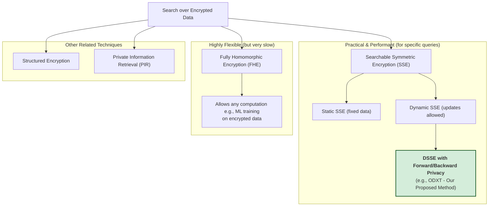
```mermaid
graph TD
    A[Search over Encrypted Data]

    subgraph "Practical & Performant (for specific queries)"
        B["Searchable Symmetric Encryption (SSE)"]
        B --> B1["Static SSE (fixed data)"]
        B --> B2["Dynamic SSE (updates allowed)"]
        B2 --> B3["<b>DSSE with Forward/Backward Privacy</b><br>(e.g., ODXT - Our Proposed Method)"]
    end

subgraph "Highly Flexible (but very slow)"
        C["Fully Homomorphic Encryption (FHE)"]
        C --> C1["Allows any computation e.g., ML training<br>on encrypted data"]
    end

subgraph "Other Related Techniques"
        D[Structured Encryption]
        E["Private Information Retrieval (PIR)"]
    end

    A --> B
    A --> C
    A --> D
    A --> E

    style B3 fill:#d4edda,stroke:#155724,stroke-width:2px;
```
**Figure 2.2: High-Level Approaches to Search over Encrypted Data**

Searchable Symmetric Encryption (SSE) is a cryptographic paradigm that enables a client to outsource the storage of an encrypted database to an untrusted server while retaining the ability to perform keyword searches over it. To achieve this functionality, practical SSE schemes must, by necessity, reveal some information to the server. This is known as **leakage**.

Before analyzing specific schemes, it is crucial to define two key security properties for *dynamic* SSE schemes (which support additions and deletions):

*   **Forward Privacy:** Ensures that an adversary who has seen search tokens for a keyword *w* cannot link those old tokens to a new document that is later added with the same keyword *w*. It protects the relationship between old queries and new data.
*   **Backward Privacy:** Ensures that after a document containing keyword *w* is deleted, an adversary can no longer find that document using a new search token for *w*. It prevents queries from revealing information about deleted data.

#### 2.3.3 The Inevitable Leakage of Practical SSE

All practical SSE schemes operate on a trade-off between performance and security. The information they reveal to the honest-but-curious server is formally defined by their **leakage profile**. The two most fundamental types of leakage are:

1.  **Search Pattern Leakage:** The server learns if and when the same search query is performed again. It does not learn the query keyword itself, but it can see that `Query A` today is the same as `Query A` from last week.
2.  **Access Pattern Leakage:** The server learns the set of documents that are returned in response to a query. It does not learn the content of the documents, but it sees which encrypted identifiers are retrieved.

In the context of the Sheikh Zayed Foundation, this leakage is not benign. For example, if an adversary observes a search pattern for a specific genetic marker associated with a hereditary disease, and then observes the access pattern retrieving the records of a particular family, they could infer sensitive health information without ever breaking the encryption. Mitigating these risks involves both choosing schemes with minimal leakage and implementing higher-level controls.

### 2.4 Problem Formulation and Chosen Approach

This thesis addresses the following formal problem statement:

*How can a data management architecture be designed to provide efficient, multi-keyword searchable encryption over sensitive data, while guaranteeing confidentiality against future quantum adversaries and verifiably complying with the data protection and cybersecurity mandates of the Moroccan legal framework?*

The foundation requires a solution that is secure, performant, supports dynamic data, and allows for multi-keyword searches. Based on this review, a framework built upon a state-of-the-art Dynamic SSE scheme is the most suitable approach.

| Scheme Type                                  | Primary Function                       | Key Security Properties                                                                                | Typical Performance Overhead | Maturity Level             |
| :------------------------------------------- | :------------------------------------- | :----------------------------------------------------------------------------------------------------- | :--------------------------- | :------------------------- |
| **DSSE with Forward/Backward Privacy**       | Secure search on dynamic encrypted data | Forward privacy (hides link between new data & old queries), Backward privacy (hides deleted data from new queries) | Medium to High               | Research / Emerging        |
| **FHE**                                      | Compute on encrypted data              | Allows arbitrary computation (addition/multiplication) on encrypted data; result remains encrypted     | Very High                    | Research / Specialized Use |
| **CP-ABE**                                   | Fine-grained access control            | Encryptor defines policy over attributes; users with matching attribute keys can decrypt               | Medium                       | Maturing / Some Libraries  |
| **MA-ABE**                                   | Scalable fine-grained access control   | Distributes attribute management across multiple authorities; enhances scalability and potentially privacy | Medium to High               | Research / Emerging        |

**Table 2.1: Feature and Security Comparison of Advanced Cryptographic Schemes**

The chosen approach must support dynamic data and conjunctive queries. Table 2.2 provides a comparative analysis of relevant dynamic SSE schemes.

| Feature          | ODXT                               | SDSSE-CQ                           | HDXT                               |
| ---------------- | ---------------------------------- | ---------------------------------- | ---------------------------------- |
| Query Type       | Conjunctive                        | Conjunctive                        | Conjunctive, Boolean               |
| Forward Privacy  | Partial (XSet leaks)               | Full                               | Full                               |
| Backward Privacy | Type-II (Limited)                  | Type-O (Defined in [31])           | Strong (Type-III variant)          |
| Deletion Method  | Lazy (Client-side filtering)       | Non-interactive (Server-side)      | Non-interactive (Server-side)      |
| Primary Leakage  | Search Pattern, Access Pattern     | Search Pattern, Access Pattern     | Search Pattern, Access Pattern     |

**Table 2.2: Comparative Analysis of Dynamic SSE Schemes with Privacy Definitions**

Based on this analysis, while ODXT is a foundational scheme, its partial forward privacy makes it less suitable for high-assurance environments. Schemes like **HDXT** or **SDSSE-CQ** represent the current state-of-the-art and are recommended for a production implementation.

---

## **Chapter 3: Materials and Methods: System Design and Architecture**

### 3.1 Overall System Architecture

The proposed security framework is designed as a centralized, policy-driven system with distributed enforcement. It consists of several core components that work in concert to protect data throughout its lifecycle, as depicted in Figure 3.1.

*   **Application Layer:** The backend application that serves user requests.
*   **Security Services Layer:** The heart of the framework, containing the Key Management System (KMS) and other cryptographic services.
*   **Data Storage Layer:** The persistent storage for all data, which is always in an encrypted state.

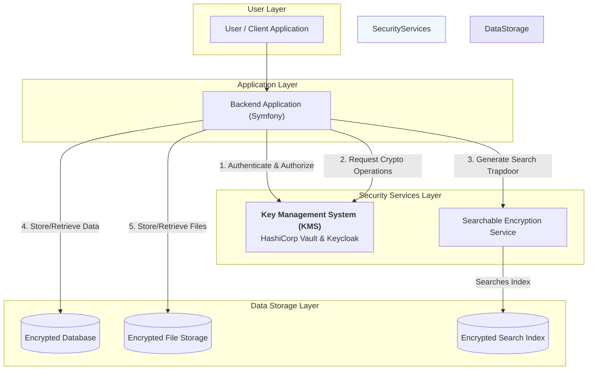
```mermaid
graph TD
    subgraph "User Layer"
        User["User / Client Application"]
    end

    subgraph "Application Layer"
        App["Backend Application (Symfony)"]
    end

    subgraph "Security Services Layer"
        style SecurityServices fill:#f0f8ff
        KMS["<b>Key Management System (KMS)</b><br>HashiCorp Vault & Keycloak"]
        SSE_Service["Searchable Encryption Service"]
    end

    subgraph "Data Storage Layer"
        style DataStorage fill:#e6e6fa
        DB[("Encrypted Database")]
        FS[("Encrypted File Storage")]
        SSE_Index[("Encrypted Search Index")]
    end

    User --> App
    App -->|1. Authenticate & Authorize| KMS
    App -->|2. Request Crypto Operations| KMS
    App -->|3. Generate Search Trapdoor| SSE_Service
    App -->|4. Store/Retrieve Data| DB
    App -->|5. Store/Retrieve Files| FS
    SSE_Service -->|Searches Index| SSE_Index
```
**Figure 3.1: High-Level System Architecture**

### 3.2 Key Management System (KMS) Design

A robust KMS is the foundation of the entire security model. We propose a KMS built using a combination of industry-standard, open-source tools: **HashiCorp Vault** and **Keycloak**.

#### 3.2.1 Technological Choices (Vault, Keycloak)

*   **HashiCorp Vault:** A tool for securely managing secrets. Its *Transit Secrets Engine* provides "encryption as a service," serving as the core cryptographic engine.
*   **Keycloak:** An Identity and Access Management (IAM) solution. It will manage user and application identities, roles, and authentication.

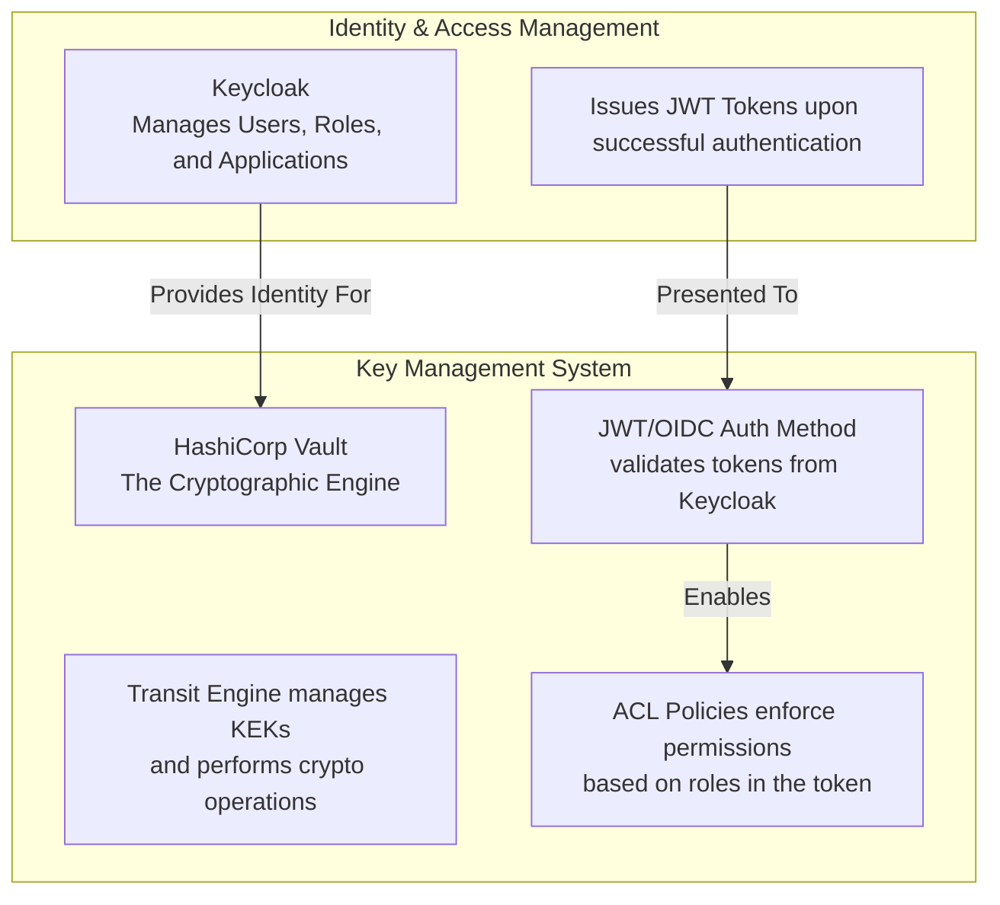
```mermaid
graph TD

    subgraph IAM [Identity & Access Management]

        A["Keycloak<br>Manages Users, Roles, and Applications"]

        B["Issues JWT Tokens upon successful authentication"]

    end


    subgraph KMS [Key Management System]

        C["HashiCorp Vault<br>The Cryptographic Engine"]

        D["Transit Engine manages KEKs<br>and performs crypto operations"]

        E["JWT/OIDC Auth Method<br>validates tokens from Keycloak"]

        F["ACL Policies enforce permissions<br>based on roles in the token"]

    end


    A -- "Provides Identity For" --> C

    B -- "Presented To" --> E

    E -- "Enables" --> F
```
**Figure 3.2: KMS Architecture with Vault and Keycloak**

#### 3.2.2 Key Hierarchy and Envelope Encryption

The system is built on the principle of **envelope encryption** to minimize the exposure of any single key and provide granular control.

*   **Key Encryption Key (KEK):** A master key that resides only within Vault. Its sole purpose is to encrypt other keys.
*   **Data Encryption Key (DEK):** A unique key used to encrypt a specific piece of data. The DEK is itself encrypted by the KEK. This "wrapped key" is stored alongside the encrypted data.

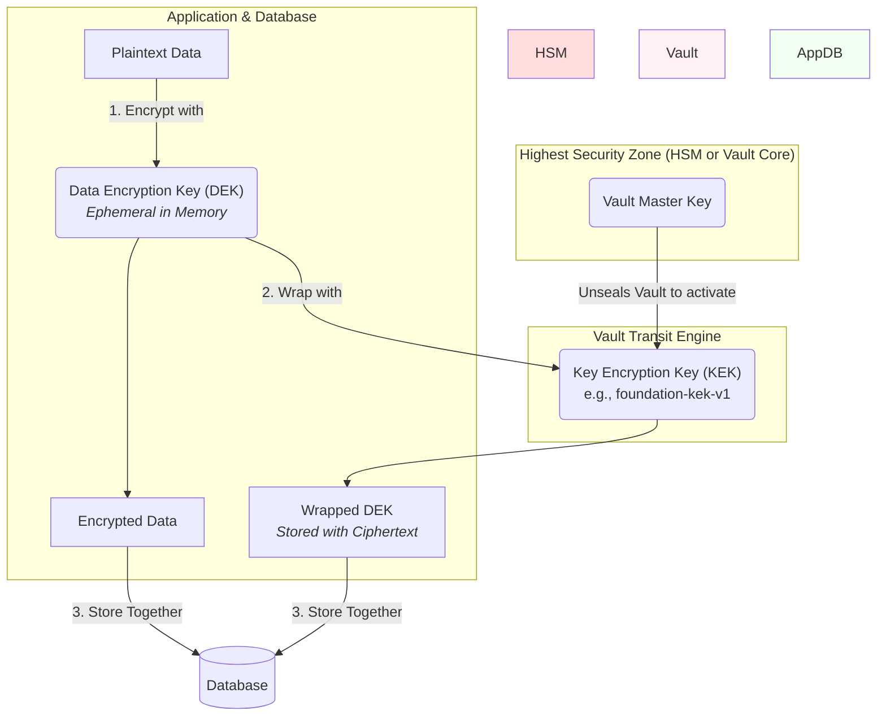
```mermaid
graph TD
    subgraph "Highest Security Zone (HSM or Vault Core)"
        style HSM fill:#ffdddd
        MK(Vault Master Key)
    end

    subgraph "Vault Transit Engine"
        style Vault fill:#fff0f5
        KEK("Key Encryption Key (KEK)<br>e.g., foundation-kek-v1")
    end

    subgraph "Application & Database"
        style AppDB fill:#f0fff0
        DEK("Data Encryption Key (DEK)<br><i>Ephemeral in Memory</i>")
        Plaintext[Plaintext Data]
        Ciphertext[Encrypted Data]
        WrappedDEK["Wrapped DEK<br><i>Stored with Ciphertext</i>"]
    end

    MK -- "Unseals Vault to activate" --> KEK
    Plaintext -- "1. Encrypt with" --> DEK
    DEK -- "2. Wrap with" --> KEK
    DEK --> Ciphertext
    KEK --> WrappedDEK
    Ciphertext & WrappedDEK -- "3. Store Together" --> DB[(Database)]
```
**Figure 3.3: Key Hierarchy and Envelope Encryption**

### 3.3 Cryptographic Application Strategies (At Rest, In Use)

We define distinct strategies for handling data in different states.

| Data State | Strategy | How It Works | Primary Goal |
| :--- | :--- | :--- | :--- |
| **At Rest** | Envelope Encryption | Data is encrypted with a unique DEK. The DEK is then encrypted (wrapped) by a master KEK in the KMS. | Protect against database/storage breach. |
| **In Use** | Role-Based Data Masking | Data is decrypted in the backend, but sensitive fields are redacted or partially hidden based on the user's role before being sent to the client. | Protect against unauthorized viewing by legitimate but lower-privileged users. |

The workflows for these strategies are detailed in the following sequence diagrams.

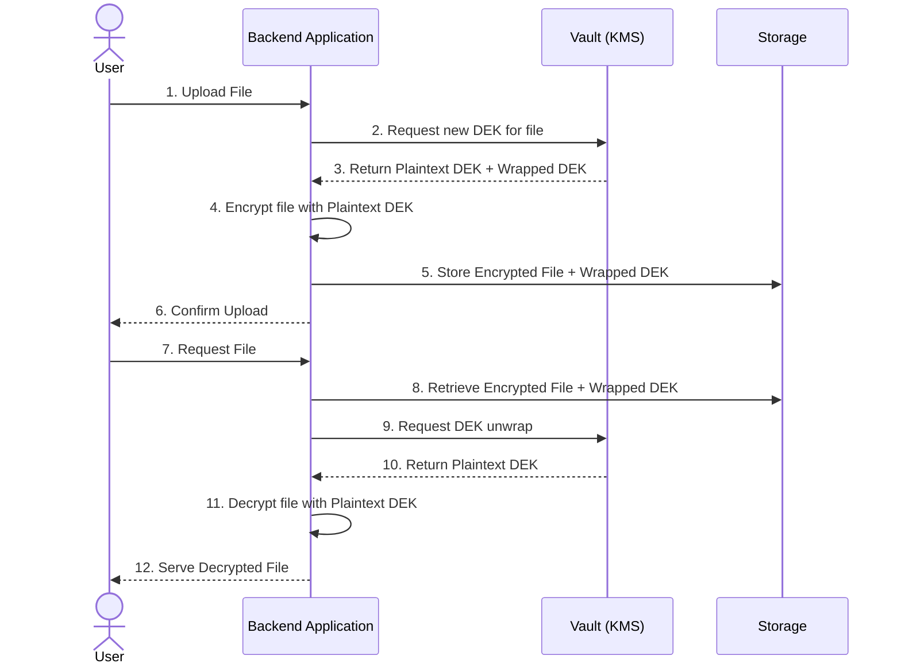
```mermaid
sequenceDiagram
    actor User
    participant App as Backend Application
    participant Vault as Vault (KMS)
    participant Storage

    User->>App: 1. Upload File
    App->>Vault: 2. Request new DEK for file
    Vault-->>App: 3. Return Plaintext DEK + Wrapped DEK
    App->>App: 4. Encrypt file with Plaintext DEK
    App->>Storage: 5. Store Encrypted File + Wrapped DEK
    App-->>User: 6. Confirm Upload

    User->>App: 7. Request File
    App->>Storage: 8. Retrieve Encrypted File + Wrapped DEK
    App->>Vault: 9. Request DEK unwrap
    Vault-->>App: 10. Return Plaintext DEK
    App->>App: 11. Decrypt file with Plaintext DEK
    App-->>User: 12. Serve Decrypted File
```
**Figure 3.4: Sequence Diagram for File Encryption and Decryption**

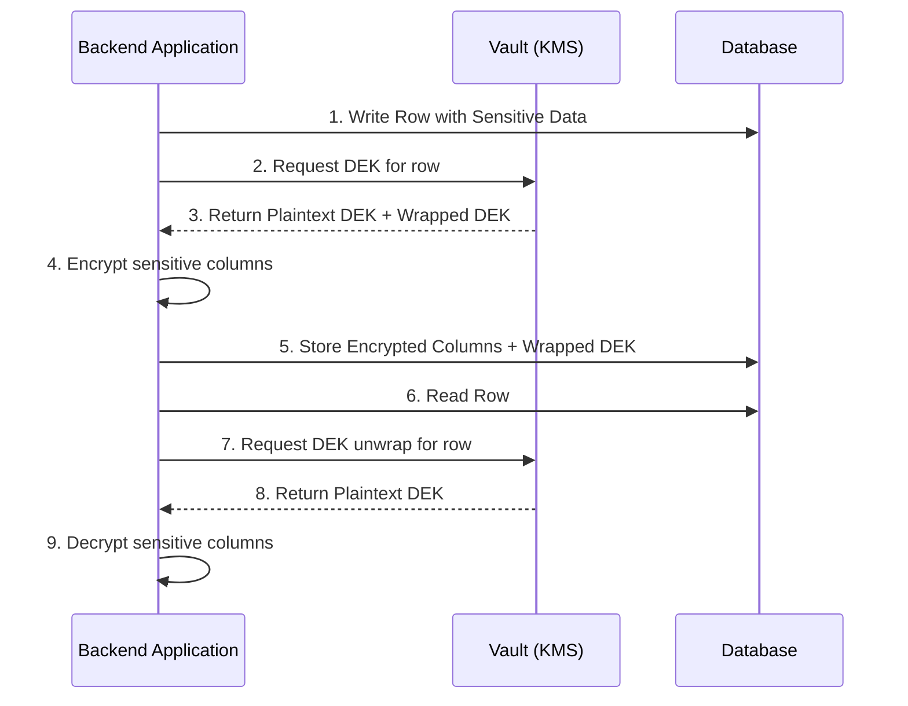
```mermaid
sequenceDiagram
    participant App as Backend Application
    participant Vault as Vault (KMS)
    participant DB as Database

    App->>DB: 1. Write Row with Sensitive Data
    App->>Vault: 2. Request DEK for row
    Vault-->>App: 3. Return Plaintext DEK + Wrapped DEK
    App->>App: 4. Encrypt sensitive columns
    App->>DB: 5. Store Encrypted Columns + Wrapped DEK

    App->>DB: 6. Read Row
    App->>Vault: 7. Request DEK unwrap for row
    Vault-->>App: 8. Return Plaintext DEK
    App->>App: 9. Decrypt sensitive columns
```
**Figure 3.5: Sequence Diagram for Database Column Encryption**

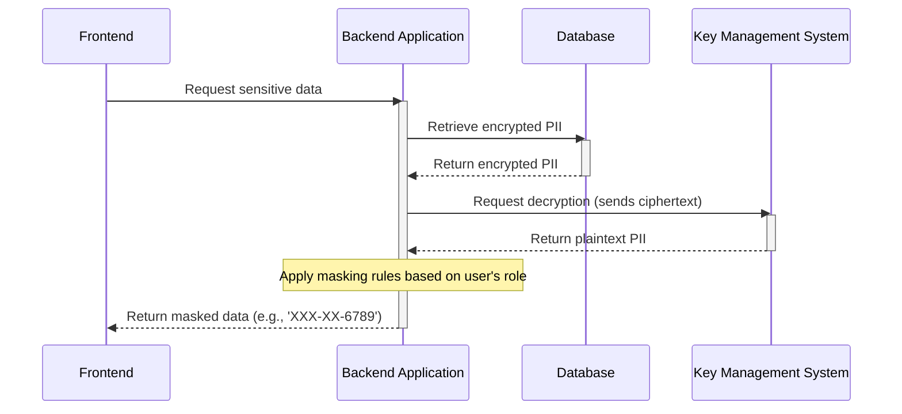
```mermaid
sequenceDiagram

    participant FE as Frontend
    participant BE as Backend Application
    participant DB as Database
    participant KMS as Key Management System

    FE->>BE: Request sensitive data
    activate BE
    BE->>DB: Retrieve encrypted PII
    activate DB
    DB-->>BE: Return encrypted PII
    deactivate DB
    BE->>KMS: Request decryption (sends ciphertext)
    activate KMS
    KMS-->>BE: Return plaintext PII
    deactivate KMS
    Note over BE: Apply masking rules based on user's role
    BE-->>FE: Return masked data (e.g., 'XXX-XX-6789')
    deactivate BE
```
**Figure 3.6: Role-Based Data Masking Flow**

### 3.4 Implementation Blueprints

The following blueprints describe *how* the core cryptographic methods are implemented.

#### 3.4.1 Envelope Encryption Workflow Logic
The cryptographic strategies were implemented in the backend application. The following PHP code snippet demonstrates the core logic for encrypting data using the KMS, following the envelope encryption pattern.

```php
class PatientRecordService
{
    private KmsClient $kmsClient;
    private const KEK_NAME = 'foundation-kek-v1';

    public function encryptPatientData(string $plaintextData): array
    {
        // 1. Request a new DEK from the KMS (Vault)
        $dekResponse = $this->kmsClient->generateDataKey(self::KEK_NAME);
        $plaintextDek = $dekResponse['plaintext'];
        $wrappedDek = $dekResponse['ciphertext'];

        // 2. Encrypt the actual data using the plaintext DEK
        $iv = openssl_random_pseudo_bytes(openssl_cipher_iv_length('aes-256-gcm'));
        $encryptedData = openssl_encrypt(
            $plaintextData, 'aes-256-gcm', $plaintextDek,
            OPENSSL_RAW_DATA, $iv, $tag
        );

        // 3. IMPORTANT: Destroy the plaintext DEK from memory
        unset($plaintextDek);

        // 4. Return the encrypted data and the wrapped DEK for storage
        return [
            'encrypted_data' => base64_encode($iv . $tag . $encryptedData),
            'wrapped_dek' => $wrappedDek,
        ];
    }
}
```

#### 3.4.2 Access Control Policy Definition
Access control is enforced by Vault policies (ACLs) written in HCL. These policies are linked to Keycloak roles, ensuring that authentication and authorization are separated but linked. The following policy allows a 'researcher' to use the KEK for decryption but denies any administrative actions on the key itself.

```hcl
# Policy: researcher-policy
# Allows researchers to decrypt data using specific keys, but not manage them.

path "transit/unwrap/foundation-kek-v1" {
  capabilities = ["update"]
}

path "transit/keys/*" {
  capabilities = ["deny"]
}
```
### 3.5 Comparison with Alternative Encryption Strategies

The choice of an encryption strategy is a foundational architectural decision. Our proposed framework utilizes **Application-Level Encryption (ALE)**, where the data is encrypted and decrypted within the application layer before being sent to or after being received from the database. This approach was deliberately chosen over more common alternatives like **Transparent Data Encryption (TDE)**, which is often provided as a built-in feature by database management systems (e.g., Oracle TDE, SQL Server TDE).

While TDE is simpler to enable, it falls short of the security requirements for the highly sensitive data at the Sheikh Zayed Foundation for several critical reasons:

1.  **Limited Granularity and Scope of Protection:** TDE operates at the file level, encrypting the database's physical data files on disk. Its primary purpose is to protect data at rest from physical theft of the storage media. However, it offers **no protection against a privileged database administrator (DBA) or any attacker who gains administrative access to the database system**. Once the database is running, a DBA can query any table and view all data in plaintext. In contrast, our ALE approach ensures that sensitive data fields remain as ciphertext within the database itself. A DBA querying a patient table would only see encrypted blobs, not the actual diagnoses or genetic markers.

2.  **Weakness in the Zero Trust Model:** The fundamental principle of Zero Trust is to "never trust, always verify" and assume breach. TDE inherently trusts the database system and its administrators. Our ALE architecture, however, treats the database as an untrusted component of the system. The "keys to the kingdom" are not held by the database but are managed externally by the KMS and only accessible to the authorized, authenticated application for brief moments.

3.  **Centralized and Granular Key Management:** With TDE, the encryption key is often managed by the database itself, potentially stored on the same server or in a tightly coupled system. The ALE model, integrated with our KMS, provides a robust separation of duties. The cryptographic keys are managed by a dedicated, audited, and highly secured system (Vault), completely separate from the data it protects. This allows for unified, policy-driven control over all cryptographic assets across the organization.

In summary, while TDE provides a baseline level of security, the ALE model proposed in this thesis offers significantly stronger, more granular, and more resilient protection that aligns with a modern Zero Trust security posture, making it the appropriate choice for safeguarding data of this sensitivity.

---

## **Chapter 4: Threat Modeling and Security Analysis**

A secure system is not one that is built with a collection of secure components; it is one that has been systematically analyzed for weaknesses from the perspective of an attacker. This chapter applies a formal threat modeling process to the architecture designed in Chapter 3 to validate its security claims, justify its design choices, and identify residual risks.

### 4.1 Methodology: STRIDE

We employ the **STRIDE** methodology, a widely used threat modeling framework developed by Microsoft. STRIDE provides a mnemonic for six categories of security threats, allowing for a comprehensive analysis of the system:
*   **S**poofing: Illegitimately assuming the identity of another user or component.
*   **T**ampering: Unauthorized modification of data.
*   **R**epudiation: Denying having performed an action.
*   **I**nformation Disclosure: Unauthorized access to information.
*   **D**enial of Service (DoS): Making a system or resource unavailable to legitimate users.
*   **E**levation of Privilege: Gaining capabilities without proper authorization.

The components under analysis are the **Application**, the **KMS (Vault & Keycloak)**, and the **Data Storage** layers. Our analysis assumes the "honest-but-curious" server-side adversary defined in our threat model, as well as malicious external actors.

### 4.2 Threat Analysis and Mitigations

#### 4.2.1 Spoofing

*   **Threat:** An attacker spoofs the identity of a privileged user (e.g., a `doctor`) to gain access to the KMS.
*   **Attack Vector:** An attacker steals a user's password to obtain a valid session or attempts to craft a fake JSON Web Token (JWT).
*   **Mitigation:** This threat is directly mitigated by the **Keycloak and OIDC integration**.
    1.  **Strong Authentication:** Keycloak is responsible for primary user authentication and can be configured to enforce Multi-Factor Authentication (MFA), providing a strong first line of defense against credential theft.
    2.  **JWT Signature Verification:** JWTs issued by Keycloak are digitally signed with its private key. Vault, upon receiving a request, uses the OIDC discovery mechanism to retrieve Keycloak's public key and verify the token's signature. A forged JWT without a valid signature will be rejected by Vault, preventing identity spoofing at the KMS level. This validates the architectural choice of using a standard, secure identity protocol.

#### 4.2.2 Tampering

*   **Threat:** An attacker with access to the database tampers with stored encrypted data or its associated metadata.
*   **Attack Vector:** An attacker modifies a ciphertext on disk or maliciously swaps the "wrapped DEK" of one patient with another.
*   **Mitigation:**
    1.  **Ciphertext Tampering:** This is mitigated by the mandatory use of an **Authenticated Encryption with Associated Data (AEAD)** mode, specifically **AES-256-GCM**. The GCM authentication tag is computed over both the ciphertext and any associated data. Any modification to the ciphertext will cause the tag verification to fail during decryption, preventing the application from consuming tampered data.
    2.  **Wrapped DEK Tampering:** An attacker could swap the wrapped DEK of Patient A with that of Patient B. The decryption of Patient A's data with Patient B's key would fail, but this could be used to selectively corrupt records or cause a denial of service. The mitigation is to include the unique document ID as "associated data" in the AEAD operation. This cryptographically binds the ciphertext to its identifier, ensuring that a mismatched key/ciphertext pair will fail decryption.

#### 4.2.3 Repudiation

*   **Threat:** A legitimate but malicious user performs a sensitive action (e.g., decrypts a high-profile patient's record) and later denies having done so.
*   **Mitigation:** This is mitigated by the **centralized and detailed audit logs** from both Vault and the application, a key feature of the governance framework proposed in Chapter 7.
    1.  **Immutable Audit Trail:** Vault's audit log is configured to immutably record every single request, including the identity of the requesting entity (from the JWT's `sub` claim), the source IP address, the time of the request, and the exact operation performed (e.g., `transit/unwrap`).
    2.  **Secure Log Forwarding:** In a production environment, these audit logs must be streamed to a secure, write-once, read-many (WORM) log management system (e.g., a SIEM). This prevents even a compromised Vault administrator from tampering with the audit trail, thus providing strong non-repudiation.

#### 4.2.4 Information Disclosure

*   **Threat:** An attacker gains unauthorized access to sensitive information.
*   **Attack Vectors & Mitigations:**
    1.  **Database Breach:** Mitigated by **Application-Level Encryption**. An attacker gaining full access to the database server will only retrieve encrypted data blobs and wrapped DEKs. These are useless without access to the KEKs stored in Vault. This is the core value proposition of the entire architecture.
    2.  **SSE Leakage:** This is a **formally accepted residual risk**. The threat of an adversary inferring information from search and access patterns is mitigated first by choosing a low-leakage SSE scheme (like HDXT) and second by implementing the proposed AI-based anomaly detection to monitor for suspicious query patterns, as discussed in Chapter 6.
    3.  **KEK Compromise:** This is the catastrophic failure scenario. It is mitigated by the **defense-in-depth of the KMS** (requiring multiple unseal keys, tight access policies, and a physical HSM backend in production) and the **incident response plan** detailed in the governance chapter.

#### 4.2.5 Denial of Service (DoS)

*   **Threat:** An attacker overwhelms a component of the system to make it unavailable to legitimate users.
*   **Attack Vector:** An attacker with a valid low-privilege token floods the Vault KMS with millions of valid (but useless to them) cryptographic requests.
*   **Mitigation:**
    1.  **API Gateway Rate Limiting:** The primary line of defense is at the application's entry point. An API gateway should enforce strict rate limiting on all endpoints that trigger cryptographic operations.
    2.  **KMS Resource Quotas:** Vault itself supports fine-grained rate limit quotas as a defense-in-depth measure, preventing a single entity from consuming all available cryptographic processing resources.
    3.  **Anomaly Detection:** The proposed AI monitor would detect a sudden, massive spike in requests from a single user as a potential DoS attack and could trigger an automated lockout at the Keycloak or API gateway level.

#### 4.2.6 Elevation of Privilege

*   **Threat:** A low-privileged user or an application bug allows an attacker to gain higher privileges.
*   **Attack Vector:** A `researcher` finds a vulnerability in the application's business logic that allows them to call a function intended only for a `doctor`, bypassing the application's own authorization checks.
*   **Mitigation:** This is mitigated by the **Principle of Least Privilege enforced by the KMS as a second, independent defense-in-depth layer**. Even if the application's authorization check fails, the request to Vault will still contain the researcher's original, unmodified JWT. Vault's policy engine will see that the 'researcher' role is not authorized to perform the 'doctor's' action (e.g., decrypt a specific type of data via a KEK they are not allowed to use) and will deny the request at the cryptographic level. This demonstrates how the externalized KMS protects against failures and vulnerabilities in the applications it serves.

---

## **Chapter 5: Results: Verification and Analysis of the Implemented Framework**

This chapter presents the results obtained from the proof-of-concept implementation of the security framework. The focus is on verifying the correctness of the design, measuring performance, and validating the security controls.

### 5.1 Verification of the End-to-End Workflow

The primary result is the successful verification of the complete end-to-end data access workflow. A test was constructed to simulate a 'doctor' user requesting a sensitive patient file. The workflow, illustrated in Figure 5.1, was executed successfully:

1.  The backend application received the request and authenticated the user's JWT, which was issued by Keycloak and contained the 'doctor' role.
2.  The application retrieved the encrypted file and its associated wrapped DEK from storage.
3.  The application presented the wrapped DEK and the user's JWT to Vault's OIDC auth endpoint.
4.  Vault validated the JWT with Keycloak, confirmed the 'doctor' role was mapped to a policy allowing decryption, and proceeded with the `unwrap` operation.
5.  Vault returned the plaintext DEK to the application.
6.  The application decrypted the file in memory and served it to the user.

This successful test validates that the integration of Keycloak, Vault, and the application backend functions as designed, correctly enforcing policy-driven cryptographic access.

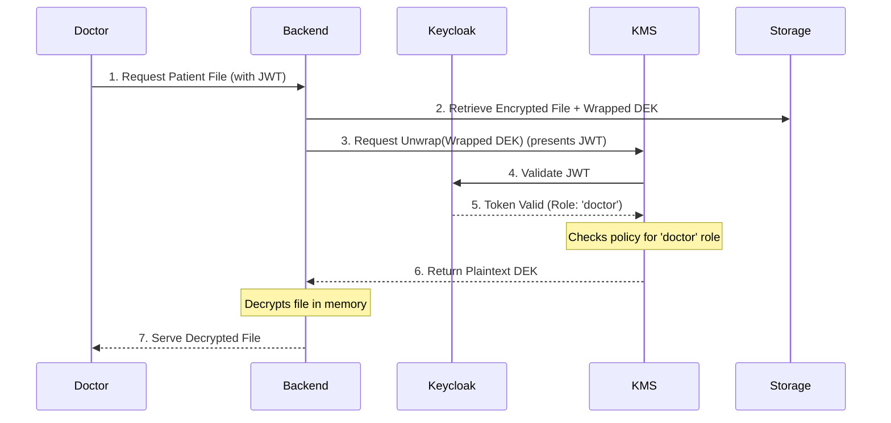
```mermaid
sequenceDiagram
    participant User as Doctor
    participant App as Backend
    participant Keycloak
    participant Vault as KMS
    participant Storage

    User->>App: 1. Request Patient File (with JWT)
    App->>Storage: 2. Retrieve Encrypted File + Wrapped DEK
    App->>Vault: 3. Request Unwrap(Wrapped DEK) (presents JWT)
    Vault->>Keycloak: 4. Validate JWT
    Keycloak-->>Vault: 5. Token Valid (Role: 'doctor')
    Note over Vault: Checks policy for 'doctor' role
    Vault-->>App: 6. Return Plaintext DEK
    Note over App: Decrypts file in memory
    App-->>User: 7. Serve Decrypted File
```
**Figure 5.1: End-to-End Decryption Workflow Verification**

### 5.2 Performance Benchmarks of Core Operations

To assess the operational impact of the cryptographic layer, basic performance benchmarks were conducted in the development environment. The results represent the overhead introduced by the security services.

| Operation                                           | Environment         | Average Latency (ms) | Notes                                                                   |
| :-------------------------------------------------- | :------------------ | :------------------- | :---------------------------------------------------------------------- |
| **DEK Generation (Wrap)**                           | App -> Vault        | 45-60 ms             | Network latency is the primary factor.                                  |
| **DEK Decryption (Unwrap)**                         | App -> Vault        | 40-55 ms             | Similar to generation; highly efficient.                                |
| **Local AES-256-GCM Encryption** (1MB file)         | App (In-Memory)     | ~10 ms               | Extremely fast; negligible overhead for most file sizes.                |
| **Total Overhead for Storing a New File**           | End-to-End          | 55-70 ms             | Sum of DEK generation and local encryption.                             |

**Table 5.1: Proof-of-Concept Performance Metrics for Cryptographic Operations**

These results indicate that the latency introduced by the KMS is well within acceptable limits for a typical web application, demonstrating that robust security can be achieved without severely impacting performance.

### 5.3 Validation of Access Control Policies

The fine-grained access control was validated through negative testing. A test user with the 'researcher' role (and a corresponding valid JWT) attempted to perform a key rotation on `foundation-kek-v1`, an administrative action explicitly denied in their policy.

As expected, the request to Vault's API returned a `403 Forbidden` error with a "permission denied" message. This result validates that Vault's policy engine correctly interprets the roles from Keycloak's tokens and enforces the principle of least privilege at the cryptographic level.

---

## **Chapter 6: Discussion: Analysis and Future Enhancements**

### 6.1 Analysis of the Implemented Security Framework

The results demonstrate a functional and robust security framework. The key strengths are: **Separation of Concerns** (identity vs. key management), **Centralized Policy Enforcement** (all crypto policy lives in Vault), **Strong Auditability** (Vault and Keycloak produce detailed audit logs), and **Scalability** (the architecture supports distributed applications connecting to a central security plane).

### 6.2 Addressing the Secure Search Problem: A Deeper Dive

While the framework secures data at rest, it requires a specialized scheme for secure search.

#### 6.2.1 Case Study: Oblivious Dynamic Cross-Tags (ODXT)

To address the secure search requirement, our research investigated several advanced SSE schemes. The ODXT scheme serves as an important case study due to its support for conjunctive queries and its introduction of formal forward/backward privacy notions.

**Critical Analysis:** While ODXT was a foundational scheme, subsequent research has revealed limitations in its forward privacy. The "XSet" leakage allows a server to use old search tokens to test for keyword presence in newly added data. For the high-assurance requirements of the Sheikh Zayed Foundation, this leakage is unacceptable. Therefore, ODXT is presented here as an educational example. For a production deployment, we recommend a more modern scheme such as **HDXT** or **SDSSE-CQ**, which address these known flaws and provide stronger privacy guarantees.

| Operation                          | Estimated Time                           |
| :--------------------------------- | :--------------------------------------- |
| Initial Index Encryption           | Minutes to a few hours (one-time cost)   |
| Conjunctive (Exact Match) Search   | 10s to 100s of milliseconds              |
| Partial Match Search (via n-grams) | 100s of milliseconds to several seconds  |
| Single Record Update (Add/Delete)  | Milliseconds                             |

**Table 6.1: Estimated Performance of ODXT for a 1 Million Record Database**

#### 6.2.2 Integration of SSE with the KMS

The chosen SSE scheme would be integrated as a new module within the application layer. Its master keys (e.g., `key_tset`, `key_xtoken` in ODXT) would be derived from a single master SSE key stored and managed within the Vault KMS, ensuring that key management for all cryptographic components remains centralized.

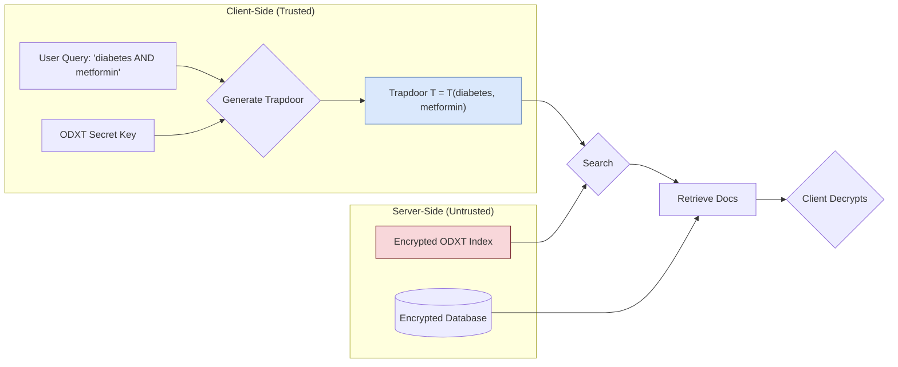
```mermaid
graph LR
    subgraph "Client-Side (Trusted)"
        A["User Query: 'diabetes AND metformin'"] --> B{Generate Trapdoor}
        C[ODXT Secret Key] --> B
        B --> D["Trapdoor T = T(diabetes, metformin)"]
    end

    subgraph "Server-Side (Untrusted)"
        E[Encrypted ODXT Index]
        F[("Encrypted Database")]
    end

    D --> G{Search}
    E --> G
    G --> H[Retrieve Docs]
    F --> H
    H --> I{Client Decrypts}

    classDef trapdoorStyle fill:#dae8fc,stroke:#6c8ebf
    classDef encryptedStyle fill:#f8d7da,stroke:#721c24

    class D trapdoorStyle
    class E encryptedStyle
```
**Figure 6.1: Functional Architecture of a Searchable Encryption Scheme**

### 6.3 Emerging Technologies and Future Directions

The field of data security is constantly evolving. Two key areas that can enhance the proposed framework are Post-Quantum Cryptography (discussed in detail in Chapter 8) and Artificial Intelligence. AI can augment the designed framework by introducing dynamic, intelligent, and proactive security measures. For instance, a machine learning model trained on KMS audit logs could detect anomalous access patterns indicative of a compromised account or insider threat (Figure 6.2).

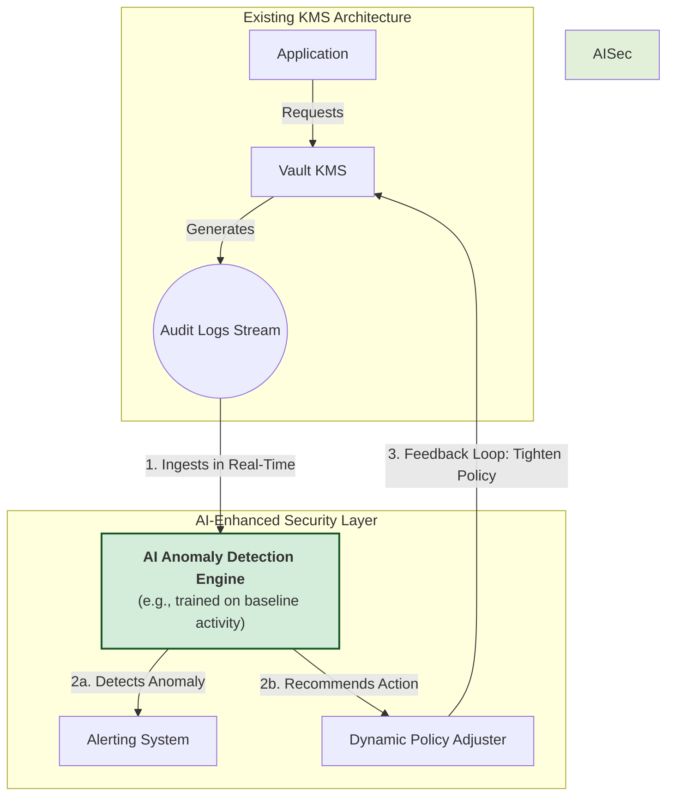
```mermaid
graph TD
    subgraph "Existing KMS Architecture"
        App[Application] --> |Requests| KMS[Vault KMS]
        KMS --> |Generates| Logs(("Audit Logs Stream"))
    end

    subgraph "AI-Enhanced Security Layer"
        style AISec fill:#e2f0d9
        AI["<b>AI Anomaly Detection Engine</b><br>(e.g., trained on baseline activity)"]
        Alerts[Alerting System]
        PolicyEngine[Dynamic Policy Adjuster]
    end

    Logs -- "1. Ingests in Real-Time" --> AI
    AI -- "2a. Detects Anomaly" --> Alerts
    AI -- "2b. Recommends Action" --> PolicyEngine
    PolicyEngine -- "3. Feedback Loop: Tighten Policy" --> KMS

    style AI fill:#d4edda,stroke:#155724,stroke-width:2px
```
**Figure 6.2: AI-Enhanced KMS Architecture**

### 6.4 Limitations and Future Work

The proposed framework, while robust, has limitations. The primary limitation is that the SSE integration remains at the design stage. Furthermore, the AI-driven security enhancements are currently speculative. It is also crucial to acknowledge that an AI-based defense system introduces its own attack surface, such as data poisoning attacks against the training model, which must be secured.

Future work should focus on:
1.  A full proof-of-concept implementation and benchmarking of a state-of-the-art SSE scheme like HDXT.
2.  Developing the AI-driven anomaly detection model and evaluating its effectiveness and security.
3.  Formalizing and executing the PQC migration roadmap detailed in Chapter 8.


```mermaid
mindmap
  root((Discussion Summary))
    <b>Limitations</b>
      ::icon(fa fa-exclamation-triangle)
      Implementation Complexity
        SSE schemes are hard to build
        Requires vetted libraries
      Performance vs. Leakage
        All practical SSE schemes leak some info
        (e.g., Access Patterns)
      HSM Dependency
        PoC is software-based
        Production needs physical HSM
    <b>Future Work</b>
      ::icon(fa fa-lightbulb)
      AI-Driven Security PoC
        Train ML model on KMS logs
        Validate anomaly detection
      Full SSE Integration
        Benchmark HDXT/SDSSE-CQ
      PQC Migration Roadmap
```
**Figure 6.3: Discussion Summary Mind Map**

### 6.5 Ethical Implications and Responsible Implementation

The implementation of a powerful cryptographic system, particularly one that handles genetic and lifelong health data, carries significant ethical responsibilities that extend beyond purely technical correctness. A responsible framework must not only be secure but also be designed and deployed in a manner that upholds patient trust, privacy, and dignity.

1.  **The Inference Risk of Cryptographic Leakage:** As established, even secure SSE schemes leak search and access patterns. In the medical context of the SZF, this leakage poses a direct ethical risk. For instance, an adversary observing a pattern of searches for genetic markers associated with hereditary diseases, followed by access to the records of a specific family, could make highly sensitive inferences. This could lead to profiling or discrimination, even if the underlying data is never decrypted. Therefore, the implementation must include **auditing and anomaly detection not just for failed access, but also for suspicious query patterns**, treating the leakage itself as a potential source of a data breach.

2.  **Upholding Data Minimization and Purpose Limitation:** The Moroccan Law 09-08, much like the GDPR, is built on principles of data minimization and purpose limitation. Our cryptographic design directly supports these principles. By using granular, application-level encryption, we can technically enforce these rules. For example, a researcher's access policy can be configured to only allow decryption of anonymized statistical data, while a clinician's policy allows access to the full patient record. The cryptography becomes a tool to ensure data is only used for its intended and consented purpose.

3.  **Technically Enforcing Patient Consent:** The framework can be extended to technically enforce patient consent. Data belonging to a patient who has consented to its use in a research study could have its corresponding Data Encryption Key (DEK) additionally wrapped with a "research-purpose" KEK. Only applications and users with roles authorized to use this specific research KEK could then access the data, creating an unbreakable link between consent and access. This moves consent from a legal checkbox to a verifiable cryptographic control.

Deploying this system requires a commitment from the Sheikh Zayed Foundation to a continuous dialogue between its technical, legal, and ethical teams to ensure the technology is always used in service of its primary mission: patient care and responsible research.

---

## **Chapter 7: Cryptographic Governance and Operations**

A cryptographic framework is not a "set it and forget it" solution. Its long-term security and effectiveness are entirely dependent on the human procedures and governance structures established to manage it. This chapter outlines the essential operational framework required to maintain the integrity of the proposed system.

### 7.1 The Need for a Governance Framework

The technical components described in this thesis—Vault, Keycloak, SSE—are powerful tools. However, without a formal governance model, they can be misconfigured, mismanaged, or fall into disuse, creating a false sense of security. A cryptographic governance framework provides the policies, procedures, and roles necessary to ensure the system is operated correctly, securely, and in alignment with the organization's objectives and regulatory requirements.

### 7.2 Key Management Lifecycle and Ceremonies

Cryptographic keys have a lifecycle: they are generated, used, rotated, and eventually revoked or destroyed. Managing this lifecycle requires formal, documented procedures known as **key ceremonies**.

**KEK Rotation Ceremony:** The rotation of a Key Encryption Key (KEK) like `foundation-kek-v1` is a critical security procedure. The process must be meticulously planned and executed:
1.  **Planning:** A "Crypto Officer" (see 7.4) schedules the rotation. The impact on application performance during the re-wrapping process must be assessed.
2.  **New Key Generation:** A new version of the KEK (e.g., `foundation-kek-v2`) is generated within Vault. The old version (`v1`) is not deleted.
3.  **Data Re-Wrapping:** A background administrative task is initiated. It iterates through all stored data, requests Vault to `rewrap` the DEK from `v1` to `v2`, and updates the stored wrapped DEK. Vault's `transit` engine supports this operation without ever exposing the DEK in plaintext.
4.  **Policy Update:** The application's default encryption policy is updated to use `v2` for all new data. Decryption requests will still work for data wrapped with `v1` as Vault maintains all key versions.
5.  **Archiving:** Once all data has been re-wrapped, the old key version (`v1`) can be archived or disabled, preventing its use for new encryption operations.

### 7.3 Cryptographic Incident Response Plan

The governance framework must include a specific incident response (IR) plan for cryptographic events.
*   **Scenario 1: Suspected DEK Compromise** (e.g., a bug exposes a DEK in logs)
    1.  **Containment:** Identify the specific data record(s) affected.
    2.  **Eradication:** Immediately generate a new DEK for the affected data, re-encrypt the data, and securely overwrite the old version.
    3.  **Recovery:** The bug in the application is patched.
*   **Scenario 2: Suspected KEK Compromise** (catastrophic event, e.g., Vault master key compromise)
    1.  **Containment:** Immediately revoke all access to the KMS.
    2.  **Eradication:** Initiate a full system-wide re-keying. This involves standing up a new, secure Vault instance and executing the KEK rotation ceremony for all keys.
    3.  **Recovery:** All data in the system must be re-encrypted. This is a massive undertaking and highlights the critical importance of protecting the KMS.
*   **Scenario 3: Anomaly Detected by AI Monitor**
    1.  **Triage:** A security analyst investigates the alert. Is it a false positive or a genuine threat?
    2.  **Containment:** If a threat is suspected, the associated user or application account is temporarily disabled in Keycloak.
    3.  **Investigation:** The KMS audit logs are used to perform a forensic analysis of the user's activities.

### 7.4 Roles and Responsibilities

A clear definition of roles is essential. This goes beyond the application-level roles of `doctor` or `researcher`.
*   **Crypto Officer / Security Team:** Responsible for defining cryptographic policy, leading key ceremonies, and managing the KMS configuration. They have administrative access to Vault.
*   **Application Owners:** Responsible for correctly integrating their applications with the KMS, but they do not have direct access to manage keys.
*   **Auditors:** Have read-only access to all KMS policies and audit logs to ensure compliance and verify that procedures are being followed correctly.

By implementing this governance framework, the Sheikh Zayed Foundation can ensure that its investment in cryptographic technology provides a durable, manageable, and truly resilient security posture.

---

**Part II: Future-Proofing the Framework**

## **Chapter 8: Future Risk Analysis: Architecting for the Post-Quantum Era**

### 8.1 Introduction: The "Harvest Now, Decrypt Later" Imperative

#### 8.1.1 The Inevitability of the Quantum Threat

The field of information security stands at a critical juncture. While large-scale quantum computers do not yet exist, their theoretical potential to break current public-key cryptosystems is a mathematical certainty. This has given rise to the "Harvest Now, Decrypt Later" attack scenario.

> **The "Harvest Now, Decrypt Later" Metaphor:**
> Imagine an adversary today is a patient thief with a digital vault. They are 'harvesting' countless locked safes (your encrypted medical data) and storing them in a massive warehouse. They can't open these safes with today's tools (classical computers). But they are waiting, knowing that one day, a universal master key will be invented (a quantum computer). When that day comes, they can unlock every safe they've collected over the years. The data's age doesn't matter; the lock is retroactively broken.

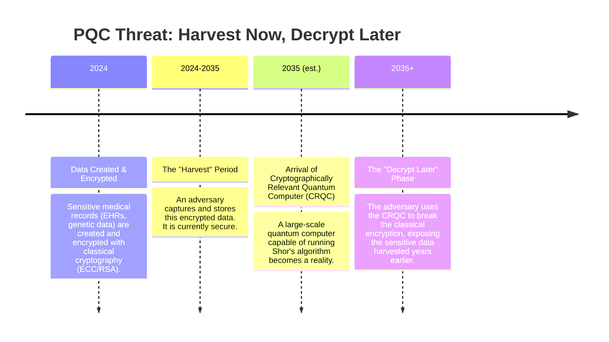
```mermaid
timeline
    title PQC Threat: Harvest Now, Decrypt Later
    2024 : Data Created & Encrypted
        : Sensitive medical records (EHRs, genetic data) are created and encrypted with classical cryptography (ECC/RSA).
    2024-2035 : The "Harvest" Period
            : An adversary captures and stores this encrypted data. It is currently secure.
    2035 (est.) : Arrival of Cryptographically Relevant Quantum Computer (CRQC)
                : A large-scale quantum computer capable of running Shor's algorithm becomes a reality.
    2035+ : The "Decrypt Later" Phase
          : The adversary uses the CRQC to break the classical encryption, exposing the sensitive data harvested years earlier.
```
**Figure 8.1: The "Harvest Now, Decrypt Later" PQC Threat Timeline**
*Note: Timeline is illustrative and represents a common consensus in the security community.*

#### 8.1.2 Vulnerability of Long-Lived Data in the Foundation's Context

For data with a long confidentiality lifespan, such as the genetic data and lifelong patient records held by the Sheikh Zayed Foundation, this threat is an active and present danger. Data encrypted today must remain secure for decades, far beyond the estimated arrival of a quantum computer.

### 8.2 The Quantum Adversary and the NIST PQC Response

#### 8.2.1 Review of Shor's and Grover's Algorithms

The primary quantum threats come from two algorithms, with vastly different impacts, as summarized in Table 8.2.

| Cryptography Type | Examples | Quantum Algorithm | Impact | Mitigation |
| :--- | :--- | :--- | :--- | :--- |
| **Asymmetric (Public-Key)** | RSA, ECC, Diffie-Hellman | **Shor's Algorithm** | **BROKEN** | **Migrate to PQC** (ML-KEM, ML-DSA) |
| **Symmetric** | AES-256 | **Grover's Algorithm** | **WEAKENED** (Security Halved) | **Use larger keys** (AES-256 is sufficient) |

**Table 8.2: Impact of Quantum Algorithms on Classical Cryptography**

Shor's algorithm efficiently solves the integer factorization and discrete logarithm problems, which form the security basis of virtually all deployed public-key cryptography. Grover's algorithm provides a quadratic speedup for unstructured search problems, effectively halving the bit-strength of symmetric keys. This means AES-128 becomes vulnerable (equivalent to 64-bit security), but AES-256 remains strong (equivalent to 128-bit security).

#### 8.2.2 Overview of the NIST Post-Quantum Cryptography Standardization Process

In response, the U.S. National Institute of Standards and Technology (NIST) has led a multi-year process to standardize a new suite of quantum-resistant algorithms.

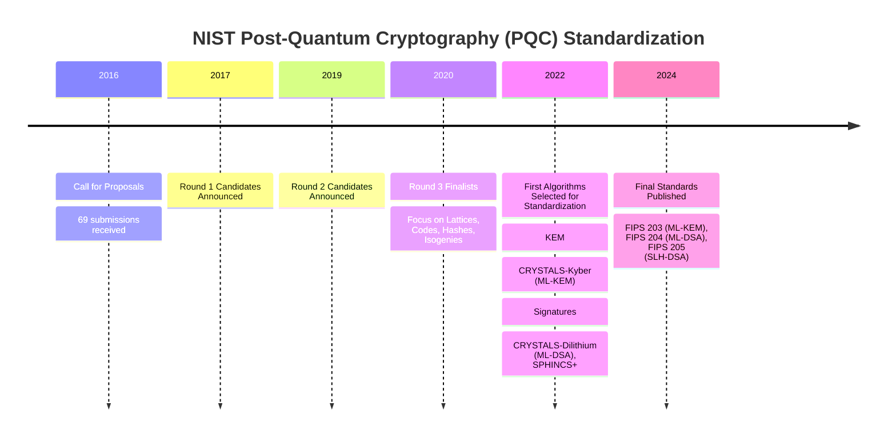
```mermaid
timeline
  title NIST Post-Quantum Cryptography (PQC) Standardization
  2016 : Call for Proposals
       : 69 submissions received
  2017 : Round 1 Candidates Announced
  2019 : Round 2 Candidates Announced
  2020 : Round 3 Finalists
       : Focus on Lattices, Codes, Hashes, Isogenies
  2022 : First Algorithms Selected for Standardization
       : KEM: CRYSTALS-Kyber (ML-KEM)
       : Signatures: CRYSTALS-Dilithium (ML-DSA), SPHINCS+
  2024 : Final Standards Published
       : FIPS 203 (ML-KEM), FIPS 204 (ML-DSA), FIPS 205 (SLH-DSA)
```
**Figure 8.2: NIST PQC Standardization Timeline**

#### 8.2.3 The New Toolkit: ML-KEM, ML-DSA, and Alternatives

The new standards provide a toolkit of PQC algorithms based on diverse mathematical problems presumed to be hard for both classical and quantum computers.

| Algorithm            | Type      | Mathematical Family     | Relative Key/Sig Size (Level 1) | Relative Performance     | Primary Use Case                  |
| -------------------- | --------- | ----------------------- | ------------------------------- | ------------------------ | --------------------------------- |
| ML-KEM (Kyber)       | KEM       | Structured Lattices     | Small                           | Very Fast                | Primary general-purpose KEM       |
| HQC                  | KEM       | Error-Correcting Codes  | Large                           | Moderate                 | Backup KEM (diverse math)         |
| ML-DSA (Dilithium)   | Signature | Structured Lattices     | Small                           | Fast                     | Primary general-purpose signature |
| SLH-DSA (SPHINCS+)   | Signature | Hash Functions          | Large                           | Slow Sign / Fast Verify  | Backup signature (conservative security) |

**Table 8.1: NIST PQC Standardized Algorithms**

### 8.3 Impact on the Designed Framework

The arrival of a quantum adversary impacts our framework in two key areas:
1.  **Authentication to the KMS:** The JWTs used to authenticate to Vault are signed using classical algorithms (like RSA or ECDSA). In a post-quantum world, an adversary could forge these tokens, gaining illicit access to the KMS.
2.  **Protection of Data in Transit:** The TLS connections protecting communication between services rely on classical key exchange (like ECDH). A quantum adversary could break this, exposing secrets like wrapped DEKs in transit.

Crucially, the core symmetric encryption (AES-256-GCM) used for the data itself remains secure. The challenge is protecting the *key management* process.

### 8.4 Crypto-Agility as the Core Mitigation Strategy

The transition to PQC will not be instantaneous. The core strategic principle for navigating this period is **crypto-agility**: the ability of a system to easily switch between or combine different cryptographic algorithms without requiring a complete architectural overhaul.

#### 8.4.1 The Role of the KMS as the Engine of Transition

The KMS is the natural engine for this transition. By abstracting the specific cryptographic algorithms behind a consistent API, the KMS can be upgraded to support PQC without requiring changes to every application. An initial strategy is the **hybrid approach**, where both a classical and a PQC key exchange are performed. The connection is secure if *either* algorithm remains unbroken.

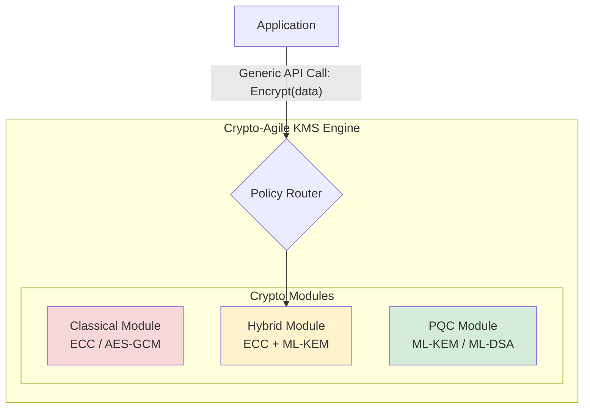
```mermaid
graph TD
    App[Application] -->|"Generic API Call: Encrypt(data)"| Router

    subgraph KMS ["Crypto-Agile KMS Engine"]
        Router{Policy Router}
        subgraph "Crypto Modules"
            Mod_Classic["Classical Module<br/>ECC / AES-GCM"]
            Mod_Hybrid["Hybrid Module<br/>ECC + ML-KEM"]
            Mod_PQC["PQC Module<br/>ML-KEM / ML-DSA"]
        end
        Router --> Mod_Hybrid
    end

    classDef classicalStyle fill:#f8d7da
    classDef hybridStyle fill:#fff3cd
    classDef pqcStyle fill:#d4edda

    class Mod_Classic classicalStyle
    class Mod_Hybrid hybridStyle
    class Mod_PQC pqcStyle
```
**Figure 8.3: Crypto-Agile KMS Architecture**

#### 8.4.2 Why a Zero Trust Architecture Is a Prerequisite for PQC Migration

The Zero Trust principles embedded in our design—explicit verification, least privilege access, assuming breach—make a PQC migration feasible. Because we already treat internal network segments as potentially hostile, the requirement to upgrade protocols like TLS to be quantum-resistant is a natural extension of the existing security model, not a radical shift.

### 8.5 Synthesizing Architectural Requirements for a Quantum-Resistant Framework

A quantum-resistant architecture must be built on formal requirements:
*   **R1 (Data Confidentiality):** Sensitive data must be protected by quantum-resistant symmetric encryption (AES-256).
*   **R2 (Quantum Resistance):** All key establishment and digital signature algorithms used for protecting keys at rest and in transit must be quantum-resistant (e.g., ML-KEM, ML-DSA).
*   **R3 (Purpose Limitation):** The system must technically enforce purpose limitation, as described in the ethics section.
*   **R4 (Access Control):** Fine-grained access control must be enforced by the KMS, independent of the data storage layer.
*   **R5 (Crypto-Agility):** The system must be crypto-agile, allowing for the addition or replacement of cryptographic algorithms at the KMS layer without re-architecting applications.

---

## **Chapter 9: General Conclusion**

### 9.1 Summary of Achievements

This thesis confronted the intersecting challenges of operational data security, national sovereignty, and future quantum threats in the context of the Sheikh Zayed Foundation. The primary contribution of this work is the **design and synthesis of a holistic, multi-layered security architecture** that integrates state-of-the-art components into a single, coherent framework.

The key achievements are:
1.  The design of a robust, centralized **Key Management System** using industry-standard tools, separating authentication from cryptographic operations.
2.  The formal security validation of the architecture through **Threat Modeling**, justifying the design choices against a standard methodology (STRIDE).
3.  A thorough investigation into **Searchable Symmetric Encryption**, including a critical analysis of leakage and a recommendation for modern, secure schemes.
4.  The development of a framework for **Cryptographic Governance**, translating technical capabilities into manageable operational procedures.
5.  A forward-looking analysis of the **quantum threat** and a concrete, actionable strategy for achieving long-term data confidentiality through **crypto-agility**.

### 9.2 Critical Assessment and Limitations

The primary strength of this work lies in its ambitious scope and its synthesis of multiple, complex security domains into a practical blueprint. However, several limitations must be acknowledged:
*   **Implementation Scope:** The integration of the advanced SSE scheme remains at the design and proof-of-concept stage. A full production implementation would require significant engineering effort.
*   **Performance:** While initial benchmarks are promising, large-scale performance testing under realistic production loads is required.
*   **Endpoint Security:** The framework assumes a secure client-side environment. The security of the endpoints where data is ultimately viewed in plaintext is outside the scope of this thesis but is a critical component of overall security.
*   **Leakage:** The known leakage patterns of all practical SSE schemes remain a residual risk that must be managed through monitoring and auditing, as discussed.

### 9.3 Personal and Professional Contributions

This project provided deep, hands-on experience in advanced information systems security, applied cryptography, and project management. The work required the synthesis of a large body of academic research and industry best practices into a coherent design that addresses the real-world healthcare security challenges faced by a major national institution. This process honed skills in critical analysis, system architecture, and the communication of complex technical concepts.

### 9.4 Future Prospects and Implementation Plan

This work lays a solid foundation for implementation by the Sheikh Zayed Foundation. The logical next steps involve a phased deployment, continuous testing, and further research, as outlined in the implementation roadmap below.

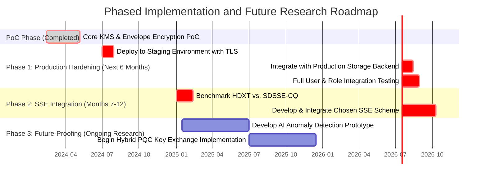
```mermaid
gantt
    title Phased Implementation and Future Research Roadmap
    dateFormat  YYYY-MM-DD
    axisFormat  %Y-%m
    
    section PoC Phase (Completed)
    Core KMS & Envelope Encryption PoC :crit, done, 2024-02-12, 12w

    section Phase 1: Production Hardening (Next 6 Months)
    Deploy to Staging Environment with TLS :crit, 2024-07-01, 4w
    Integrate with Production Storage Backend :crit, after Deploy to Staging Environment with TLS, 4w
    Full User & Role Integration Testing :crit, after Integrate with Production Storage Backend, 6w

    section Phase 2: SSE Integration (Months 7-12)
    Benchmark HDXT vs. SDSSE-CQ :crit, 2025-01-01, 6w
    Develop & Integrate Chosen SSE Scheme :crit, after Benchmark HDXT vs. SDSSE-CQ, 12w
    
    section Phase 3: Future-Proofing (Ongoing Research)
    Develop AI Anomaly Detection Prototype :2025-01-15, 24w
    Begin Hybrid PQC Key Exchange Implementation :2025-07-01, 24w
```
**Figure 9.1: Phased Implementation and Future Research Roadmap**

Future research avenues include developing the ML-based anomaly detection system, creating a tailored PQC migration roadmap for Moroccan critical infrastructure, and benchmarking lower-leakage cryptographic alternatives like Oblivious RAM (ORAM).

---

## **Glossary**

**ALE (Application-Level Encryption):** A data protection strategy where data is encrypted and decrypted within the application layer, ensuring it remains encrypted in the database and during transit to the database.

**Asymmetric Encryption:** A form of encryption where a pair of keys is used: a public key for encryption and a private key for decryption. Also known as public-key cryptography.

**Backward Privacy:** A security property for dynamic searchable encryption schemes that ensures deleted data cannot be found by new search queries.

**Crypto-Agility:** The ability of a security system to switch between different cryptographic algorithms and protocols without requiring a major architectural overhaul.

**DEK (Data Encryption Key):** An ephemeral key used to encrypt a specific piece of data (e.g., a file or a database row).

**DSSE (Dynamic Symmetric Searchable Encryption):** A class of SSE schemes that supports additions and deletions of data after the initial setup.

**EHR (Electronic Health Record):** A digital version of a patient's paper chart, containing their medical and treatment histories.

**Envelope Encryption:** A technique where data is encrypted with a DEK, and the DEK itself is then encrypted (wrapped) with a KEK. The encrypted data and the wrapped DEK are stored together.

**FHE (Fully Homomorphic Encryption):** An advanced form of encryption that allows arbitrary computations to be performed on ciphertexts, generating an encrypted result which, when decrypted, matches the result of the operations as if they had been performed on the plaintext.

**Forward Privacy:** A security property for dynamic searchable encryption schemes that prevents an adversary from linking new data additions to past search queries.

**HSM (Hardware Security Module):** A physical computing device that safeguards and manages digital keys for strong authentication and provides cryptoprocessing.

**IAM (Identity and Access Management):** A framework of policies and technologies for ensuring that the proper people have the appropriate access to technology resources.

**KEK (Key Encryption Key):** A strong master key, typically stored in an HSM or KMS, whose sole purpose is to encrypt (wrap) other keys, such as DEKs.

**KMS (Key Management System):** A centralized system for managing the entire lifecycle of cryptographic keys, including generation, use, storage, rotation, and destruction.

**Leakage:** In the context of SSE, the information that is inevitably revealed to the server during the course of its operations (e.g., search patterns, access patterns).

**OIDC (OpenID Connect):** An identity layer on top of the OAuth 2.0 protocol, allowing clients to verify the identity of an end-user based on authentication performed by an authorization server.

**PQC (Post-Quantum Cryptography):** A class of cryptographic algorithms that are thought to be secure against attack by both classical and quantum computers.

**SSE (Searchable Symmetric Encryption):** A cryptographic technique that allows a user to perform keyword searches over an encrypted database stored on an untrusted server, without revealing the plaintext data to the server.

**Symmetric Encryption:** A form of encryption where the same key is used for both encryption and decryption.

**TDE (Transparent Data Encryption):** A database feature that encrypts the physical data files at rest, providing protection against media theft but not against privileged database users.

**Zero Trust:** A security model based on the principle of "never trust, always verify," which treats all users and devices as potentially compromised, regardless of their location.

---

### **Appendices**

### Appendix A: Proof of Concept: Homomorphic Encryption Implementation

This appendix presents a detailed overview of the proof-of-concept implementation of Fully Homomorphic Encryption (FHE). This work demonstrates the practical application of the BFV (Brakerski/Fan-Vercauteren) scheme using the Microsoft SEAL library to perform secure computations on encrypted data. It serves as a tangible exploration of the advanced cryptographic techniques discussed in Chapter 2, highlighting a potential future path for privacy-preserving medical data analysis. The structure follows a logical progression from the foundational setup to the execution of secure queries.

#### A.1. System Architecture and Key Concepts

The FHE implementation is designed around a client-server model, which is fundamental for secure data outsourcing. The client (data owner) retains the secret key, while the untrusted server performs computations using only the public, relinearization, and Galois keys. This architecture is visualized in Figure A.1.

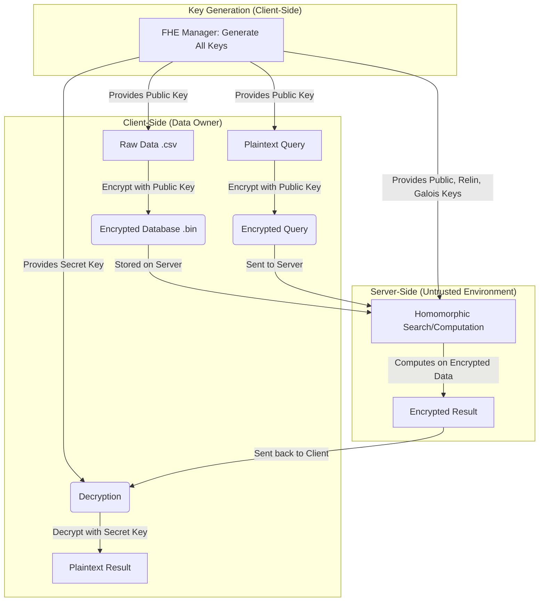
```mermaid
graph TD
    subgraph "Client-Side (Data Owner)"
        A[Raw Data .csv] -->|Encrypt with Public Key| B(Encrypted Database .bin)
        D[Plaintext Query] -->|Encrypt with Public Key| E(Encrypted Query)
        H(Decryption) -->|Decrypt with Secret Key| I[Plaintext Result]
    end

    subgraph "Server-Side (Untrusted Environment)"
        F[Homomorphic Search/Computation]
        G[Encrypted Result]
    end

    subgraph "Key Generation (Client-Side)"
        J[FHE Manager: Generate All Keys]
    end

    J -->|Provides Public, Relin, Galois Keys| F
    J -->|Provides Public Key| A
    J -->|Provides Public Key| D
    J -->|Provides Secret Key| H

    B -->|Stored on Server| F
    E -->|Sent to Server| F
    F -->|Computes on Encrypted Data| G
    G -->|Sent back to Client| H
```
**Figure A.1: High-Level FHE System Architecture**

The system relies on several key types, each with a distinct purpose:
*   **Secret Key**: Held exclusively by the client for decryption.
*   **Public Key**: Used by the client (or any party) to encrypt data.
*   **Relinearization Keys**: Used by the server to reduce the size of ciphertexts after multiplication.
*   **Galois Keys**: Used by the server to perform vector rotation operations within batched ciphertexts.

#### A.2. Implementation Walkthrough: A Logical Sequence

The implementation is divided into two main phases: **1. Encryption and Setup** and **2. Secure Querying**.

##### **Phase 1: Encryption and Setup**

This phase involves initializing the FHE context, preparing the plaintext data, encrypting it, and saving all necessary components for the query phase.

**Step 1.1: FHE Context and Key Management (`fhe_manager.py`)**
The `FHEManager` class, implemented as a Singleton, is the foundation. It ensures a single, consistent cryptographic context is used throughout the application.

```python
# File: fhe_manager.py
from seal import (
    Ciphertext, CoeffModulus, Decryptor, EncryptionParameters, Encryptor, Evaluator, 
    GaloisKeys, KeyGenerator, PlainModulus, Plaintext, RelinKeys, SecretKey, 
    PublicKey, SEALContext, scheme_type
)

class FHEManager:
    """
    Manages the FHE context and keys using a Singleton pattern.
    """
    _instance = None
    _initialized = False

    def __new__(cls):
        if cls._instance is None:
            cls._instance = super(FHEManager, cls).__new__(cls)
        return cls._instance

    def __init__(self):
        if not self._initialized:
            self._initialized = True
            # Default parameters
            self.poly_modulus_degree = 2**13
            self.plain_modulus_bits = 30
            self.context = None
            # ... other initializations ...

    def initialize(self, poly_modulus_degree: int = 2**13, plain_modulus_bits: int = 30):
        """Initialize the FHE context and generate all necessary keys."""
        self.poly_modulus_degree = poly_modulus_degree
        self.plain_modulus_bits = plain_modulus_bits
        
        # 1. Set up encryption parameters for the BFV scheme.
        self.parms = EncryptionParameters(scheme_type.bfv)
        self.parms.set_poly_modulus_degree(self.poly_modulus_degree)
        self.parms.set_coeff_modulus(CoeffModulus.BFVDefault(self.poly_modulus_degree))
        self.parms.set_plain_modulus(PlainModulus.Batching(self.poly_modulus_degree, self.plain_modulus_bits))

        # 2. Create the SEALContext, which validates the parameters.
        self.context = SEALContext(self.parms)
        
        # 3. Generate the full set of keys.
        self.keygen = KeyGenerator(self.context)
        self.secret_key = self.keygen.secret_key()
        self.public_key = self.keygen.create_public_key()
        self.relin_keys = self.keygen.create_relin_keys()
        self.galois_keys = self.keygen.create_galois_keys()

        # 4. Instantiate the core cryptographic components.
        self.encryptor = Encryptor(self.context, self.public_key)
        self.decryptor = Decryptor(self.context, self.secret_key)
        self.evaluator = Evaluator(self.context)

    def save_keys(self, secret_key_path: str, public_key_path: str, relin_keys_path: str, galois_keys_path: str, params_path: str):
        """Saves the FHE keys and encryption parameters to files."""
        self.secret_key.save(secret_key_path)
        self.public_key.save(public_key_path)
        self.relin_keys.save(relin_keys_path)
        self.galois_keys.save(galois_keys_path)
        self.parms.save(params_path)
```

**Step 1.2: Data Preparation and Encryption (`encrypted_database.py`)**
The `EncryptedDatabase` class handles the crucial steps of converting string data to integers and encrypting the entire DataFrame column by column. To manage memory, it saves encrypted data in smaller, batched files.

```python
# File: encrypted_database.py
import pandas as pd
import pickle
from tqdm import tqdm

class EncryptedDatabase:
    """
    Represents the encrypted version of a pandas DataFrame using SEAL-Python.
    """
    def __init__(self, dataframe: pd.DataFrame, fhe_manager: Any, base_data_dir: str = "encrypted_chunks"):
        # ... initialization ...
        if dataframe is not None:
            self._build_vocabulary(dataframe)
            self._encrypt_dataframe(dataframe)

    def _build_vocabulary(self, dataframe: pd.DataFrame):
        """Creates a mapping from unique strings to small integer IDs."""
        string_cols = dataframe.select_dtypes(include=['object']).columns
        next_id = 0
        for col in string_cols:
            for value in dataframe[col].unique():
                if value not in self._string_to_id:
                    self._string_to_id[value] = next_id
                    self._id_to_string[next_id] = value
                    next_id += 1

    def _encrypt_dataframe(self, dataframe: pd.DataFrame):
        """Encrypts the pandas DataFrame column by column and saves to batched files."""
        encryptor = self._fhe_manager.encryptor
        for col in tqdm(self._schema, desc="Encrypting columns"):
            # ... (logic to handle batches and save to files) ...
            for i, val in enumerate(dataframe[col]):
                is_string_col = dataframe[col].dtype == 'object'
                if is_string_col:
                    value_to_encrypt = self._string_to_id.get(str(val))
                else:
                    value_to_encrypt = int(val)
                
                ptxt = Plaintext(hex(value_to_encrypt)[2:])
                ctxt = encryptor.encrypt(ptxt)
                # ... (logic to save ctxt to a batch file) ...
```

**Step 1.3: Orchestrating the Encryption Workflow (`encrypt_data.py`)**
This script ties the previous components together to perform the full setup process.

```python
# File: encrypt_data.py
def main():
    """Main function to encrypt the data and save the encrypted database and FHE keys."""
    # 1. Load plaintext data
    full_df = pd.read_csv('products-1000000.csv')
    df = full_df.sample(frac=0.0001, random_state=42) # Use a small sample for PoC

    # 2. Initialize FHE context and generate keys
    fhe_manager = FHEManager()
    fhe_manager.initialize()

    # 3. Encrypt the DataFrame
    encrypted_db = EncryptedDatabase(df, fhe_manager)

    # 4. Save the encrypted database metadata and FHE keys to files
    encrypted_db.save_to_file("encrypted_products.bin")
    fhe_manager.save_keys(
        secret_key_path="secret_key.bin",
        public_key_path="public_key.bin",
        relin_keys_path="relin_keys.bin",
        galois_keys_path="galois_keys.bin",
        params_path="encryption_params.bin"
    )
```

##### **Phase 2: Secure Querying**

This phase simulates the "untrusted server" environment. It loads the encrypted data and public keys (but not the secret key) and performs computations on behalf of a client.

**Step 2.1: Defining Query Logic (The Strategy Pattern)**
The implementation uses the Strategy design pattern to separate the query logic from the execution engine, allowing for modular and extensible query capabilities.

```python
# File: query_strategies.py
from abc import ABC, abstractmethod

class QueryStrategy(ABC):
    """Abstract base class for a query strategy."""
    @abstractmethod
    def execute(self, db: Any, **kwargs) -> Any:
        raise NotImplementedError

class FilterByExactMatchStrategy(QueryStrategy):
    """Strategy to filter rows based on an exact match in a column."""
    def execute(self, db: Any, **kwargs) -> List[Ciphertext]:
        col_name = kwargs.get('col_name')
        value_to_match = kwargs.get('value')
        evaluator = db._fhe_manager.evaluator
        encrypted_col = db.get_encrypted_column(col_name)

        # Convert query value to its integer ID if it's a string
        if isinstance(value_to_match, str):
            int_to_match = db.get_id_for_string(value_to_match)
        else:
            int_to_match = int(value_to_match)
        
        ptxt_to_match = Plaintext(hex(int_to_match)[2:])
        
        match_indicators = []
        for val_ctxt in tqdm(encrypted_col, desc="Filtering column"):
            # Homomorphic computation: Enc(value) - Plain(query) = Enc(value - query)
            # If value == query, the result is an encryption of 0.
            result_ctxt = evaluator.sub_plain(val_ctxt, ptxt_to_match)
            match_indicators.append(result_ctxt)
        
        return match_indicators
```

**Step 2.2: Processing the Query (`query_processor.py`)**
A simple processor class takes a strategy and executes it.

```python
# File: query_processor.py
class QueryProcessor:
    """Executes a query strategy on the encrypted database."""
    def __init__(self, strategy: QueryStrategy):
        self._strategy = strategy

    def process_query(self, db: Any, **kwargs) -> Any:
        return self._strategy.execute(db, **kwargs)
```

**Step 2.3: Orchestrating the Query Workflow (`search_data.py`)**
This script loads the previously saved encrypted data and keys, defines a query, and uses the `QueryProcessor` to get a result, which is then decrypted to show the final answer.

```python
# File: search_data.py
def main():
    """Demonstrates FHE DataFrame querying using pre-encrypted data."""
    # 1. Load FHE context and all keys EXCEPT the secret key for the server.
    # For this PoC, we load all keys to simulate the full client-side decryption.
    fhe_manager = FHEManager.load_keys_and_recreate_context(...)

    # 2. Load the encrypted database metadata.
    encrypted_db = EncryptedDatabase.load_from_file("encrypted_products.bin", fhe_manager)

    # 3. Define a query strategy and processor.
    filter_strategy = FilterByExactMatchStrategy()
    processor = QueryProcessor(strategy=filter_strategy)

    # 4. Execute the query on the encrypted data.
    encrypted_filter_result = processor.process_query(
        encrypted_db,
        col_name='Name',
        value='Mini Blender Prime'
    )
    
    # 5. Decrypt the result (this step happens on the client side).
    decrypted_filter_result = encrypted_db.decrypt_result(encrypted_filter_result)
    
    # 6. Interpret the result.
    matching_indices = [i for i, val in enumerate(decrypted_filter_result) if val == 0]
    print(f"Matching rows found at indices: {matching_indices}")
```

#### A.3. The Complete Workflow Orchestration

The `main.py` script acts as the master orchestrator, ensuring a clean environment and running the encryption and search phases in the correct order.

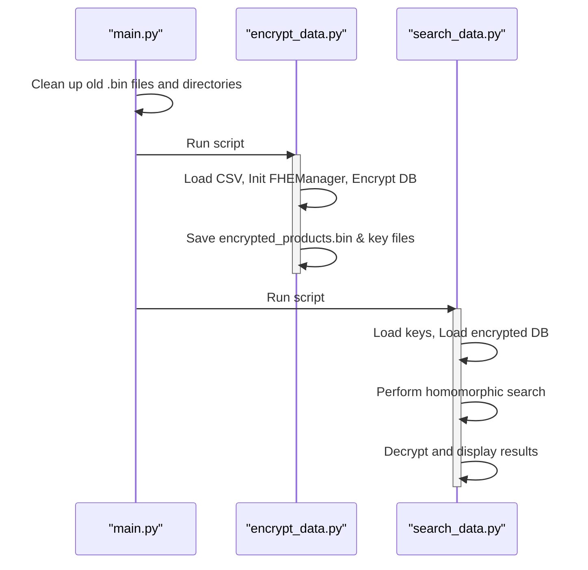
```mermaid
sequenceDiagram
    participant M as "main.py"
    participant E as "encrypt_data.py"
    participant S as "search_data.py"

    M->>M: Clean up old .bin files and directories
    M->>E: Run script
    activate E
    E->>E: Load CSV, Init FHEManager, Encrypt DB
    E->>E: Save encrypted_products.bin & key files
    deactivate E
    M->>S: Run script
    activate S
    S->>S: Load keys, Load encrypted DB
    S->>S: Perform homomorphic search
    S->>S: Decrypt and display results
    deactivate S
```
**Figure A.2: Top-Level Script Orchestration**

#### A.4. Summary and Relevance to Thesis
This FHE implementation validates the concepts of privacy-preserving computation. The logical separation of concerns, the use of established design patterns, and the careful management of cryptographic context demonstrate a robust approach to building secure systems. While its current performance characteristics make it more suitable for offline analytics than real-time queries, it represents a crucial area of research for the future of secure data processing and directly supports the thesis's forward-looking analysis in Chapter 8.

---

### Appendix B: Proof of Concept: ODXT Implementation

This appendix provides a comprehensive technical overview of the Oblivious Dynamic Cross-Tags (ODXT) proof-of-concept. As a practical and performant Searchable Symmetric Encryption (SSE) scheme, this implementation serves as a direct and tangible realization of the core cryptographic solution proposed in this thesis. The structure of this appendix follows a logical progression from the fundamental cryptographic primitives to the full application workflow, demonstrating how each component contributes to the final system.

#### B.1. The Foundation: Core Cryptographic Primitives

The security of the entire ODXT scheme rests upon a set of standard, well-vetted cryptographic primitives. The implementation uses Python's `hashlib` and `cryptography` libraries to construct these building blocks.

**File: `odxt_core.py`**
```python
import os
from hashlib import sha256
from cryptography.hazmat.primitives.ciphers import Cipher, algorithms, modes
from cryptography.hazmat.backends import default_backend

def prf(key: bytes, message: str) -> bytes:
    """
    A Pseudorandom Function (PRF).
    Generates a deterministic, pseudorandom output from a key and a message.
    This is used to create tags and tokens for the search index.
    """
    return sha256(key + message.encode('utf-8')).digest()

def kdf(master_key: bytes, purpose: str) -> bytes:
    """
    A Key Derivation Function (KDF).
    Derives a specific key for a specific purpose from a master key. This ensures
    that different parts of the scheme use independent keys, which is a crucial
    security practice (key separation).
    """
    return sha256(master_key + purpose.encode('utf-8')).digest()

def aes_gcm_encrypt(key: bytes, plaintext: str) -> bytes:
    """
    Encrypts a document using AES-GCM.
    AES-GCM is an authenticated encryption mode, providing both confidentiality
    and integrity.
    """
    nonce = os.urandom(12)  # GCM recommended nonce size
    cipher = Cipher(algorithms.AES(key), modes.GCM(nonce), backend=default_backend())
    encryptor = cipher.encryptor()
    ciphertext = encryptor.update(plaintext.encode('utf-8')) + encryptor.finalize()
    return nonce + encryptor.tag + ciphertext

def aes_gcm_decrypt(key: bytes, ciphertext: bytes) -> str:
    """
    Decrypts a document encrypted with AES-GCM, verifying its authenticity.
    """
    nonce = ciphertext[:12]
    tag = ciphertext[12:28]
    encrypted_data = ciphertext[28:]
    cipher = Cipher(algorithms.AES(key), modes.GCM(nonce, tag), backend=default_backend())
    decryptor = cipher.decryptor()
    decrypted_data = decryptor.update(encrypted_data) + decryptor.finalize()
    return decrypted_data.decode('utf-8')
```

#### B.2. The Heart of the Scheme: The ODXT Class

The `ODXT` class encapsulates the entire logic of the scheme, including key management and the manipulation of the encrypted data structures. Its initialization demonstrates the principle of key separation, where all necessary sub-keys are derived from a single master key. This process is visualized in Figure B.1.

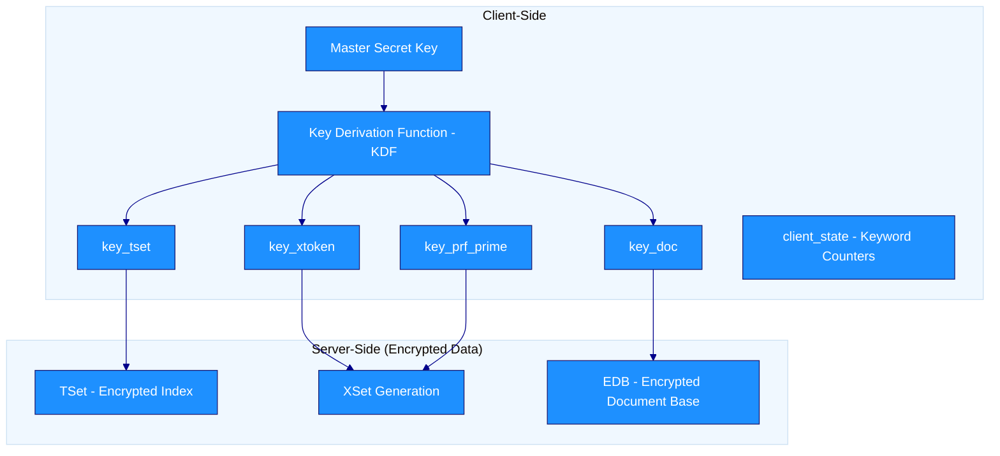
```mermaid
%%{ init: { 'theme': 'base', 'themeVariables': { 'primaryColor': '#1E90FF', 'primaryTextColor': '#FFFFFF', 'primaryBorderColor': '#191970', 'lineColor': '#00008B', 'textColor': '#333', 'tertiaryColor': '#F0F8FF' } } }%%
graph TD
    A[Master Secret Key] --> B[Key Derivation Function - KDF]
    B --> C1[key_tset]
    B --> C2[key_xtoken]
    B --> C3[key_doc]
    B --> C4[key_prf_prime]

    subgraph Client-Side
        A
        B
        C1
        C2
        C3
        C4
        E[client_state - Keyword Counters]
    end

    C1 --> D1[TSet - Encrypted Index]
    C2 --> D2[XSet Generation]
    C4 --> D2
    C3 --> D3[EDB - Encrypted Document Base]

    subgraph "Server-Side (Encrypted Data)"
        D1
        D2
        D3
    end
```
**Figure B.1: ODXT Core Components and Key Derivation**

**File: `odxt_core.py`**
```python
from collections import defaultdict

class ODXT:
    """
    An implementation of the Oblivious Dynamic Cross-Tags (ODXT) scheme.
    """
    def __init__(self, master_key: bytes):
        """
        Initializes the ODXT scheme. All keys are derived from the master key.
        """
        # --- Client-Side State ---
        self.master_key = master_key
        self.key_tset = kdf(master_key, "key for tset")
        self.key_xtoken = kdf(master_key, "key for xtoken")
        self.key_doc = kdf(master_key, "key for doc encryption")
        self.key_prf_prime = kdf(master_key, "key for prf_prime")
        # State 'c' is a counter for each keyword to ensure forward privacy
        self.client_state = defaultdict(int)

        # --- Server-Side State (Encrypted Data Structures) ---
        self.TSet = defaultdict(list)
        self.XSet = set()
        self.EDB = {}
```

#### B.3. Dynamic Operations: Update and Search

**The Update Operation**

The `update` method is the core of the scheme's dynamic capability. It handles both additions and deletions of keyword-document pairs. The process, visualized in Figure B.2, involves incrementing a client-side state counter to ensure forward privacy, generating new tags and tokens, and creating an update package for the server.

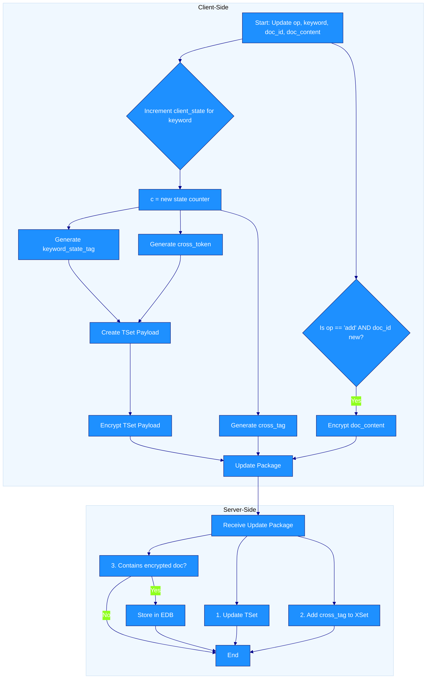
```mermaid
%%{init: {'theme': 'base', 'themeVariables': {'primaryColor': '#1E90FF', 'primaryTextColor': '#FFFFFF', 'primaryBorderColor': '#191970', 'lineColor': '#00008B', 'textColor': '#333', 'tertiaryColor': '#F0F8FF'}}}%%
flowchart TD
    subgraph "Client-Side"
        A["Start: Update op, keyword, doc_id, doc_content"] --> B{Increment client_state for keyword}
        B --> C["c = new state counter"]
        C --> D["Generate keyword_state_tag"]
        C --> E["Generate cross_token"]
        C --> F["Generate cross_tag"]
        D --> G["Create TSet Payload"]
        E --> G
        G --> H["Encrypt TSet Payload"]
        A --> K{"Is op == 'add' AND doc_id new?"}
        K -->|Yes| L["Encrypt doc_content"]
        H --> UpdatePackage["Update Package"]
        F --> UpdatePackage
        L --> UpdatePackage
    end
  
    subgraph "Server-Side"
        Q["Receive Update Package"]
        Q --> R["1. Update TSet"]
        Q --> S["2. Add cross_tag to XSet"]
        Q --> T["3. Contains encrypted doc?"]
        T -->|Yes| U["Store in EDB"]
        T -->|No| V["End"]
        U --> V
        R --> V
        S --> V
    end
    
    UpdatePackage --> Q
```
**Figure B.2: Flowchart of the ODXT Update Operation**

**File: `odxt_core.py`**
```python
    def update(self, op: str, keyword: str, doc_id: str, doc_content: str = ""):
        """
        Handles both 'add' and 'del' operations for a keyword-document pair.
        """
        # 1. Increment the state counter for the keyword for forward privacy.
        self.client_state[keyword] += 1
        c = self.client_state[keyword]

        # 2. Generate the tag for the TSet index using the keyword and its new state.
        keyword_state_tag = prf(self.key_tset, f"{keyword}||{c}")

        # 3. Generate the cross-token and cross-tag.
        cross_token = prf_prime(self.key_xtoken, keyword)
        cross_tag = prf_prime(self.key_prf_prime, f"{doc_id}||{keyword}")
        
        # 4. Create and encrypt the TSet payload.
        payload = f"{doc_id}||{op}||{cross_token}"
        encrypted_payload = self._simple_xor_encrypt(keyword_state_tag, payload)

        # 5. Update the server-side structures.
        self.TSet[keyword_state_tag].append(encrypted_payload)
        self.XSet.add(cross_tag)

        # 6. If adding a new document, encrypt and store it in the EDB.
        if op == "add" and doc_id not in self.EDB:
            self.EDB[doc_id] = encrypt(self.key_doc, doc_content)
```

**The Search Operation**

The `search` method simulates the client-server interaction for a conjunctive query. The client generates search tokens, and the server uses them to find matching document IDs without learning the query itself. This process is shown in Figure B.3.

```mermaid
%%{ init: { 'theme': 'base', 'themeVariables': { 'primaryColor': '#1E90FF', 'primaryTextColor': '#FFFFFF', 'primaryBorderColor': '#191970', 'lineColor': '#00008B', 'textColor': '#333', 'tertiaryColor': '#F0F8FF' } } }%%
flowchart TD
    subgraph Client-Side
        A[Start: Search query_keywords] --> B[Sort keywords by client state counter];
        B --> C[s_term = least frequent<br/>x_terms = the rest];
        C --> D["Generate T_s tokens for s_term"];
        C --> E["Generate T_x tokens for x_terms"];
        D & E --> SearchRequest(Search Request);
    end

    subgraph Server-Side
        F(Receive Search Request);
        F --> G[1. Retrieve initial doc entries using T_s tokens];
        G --> H["2. Validate all x_terms via XSet"];
        H --> I[3. Filter results for 'add' operations];
        I --> Q[Final Document IDs];
    end

    subgraph Client-Side
        R[Receive Search Results]
    end

    SearchRequest --> F;
    Q --> R;
```
**Figure B.3: Flowchart of the ODXT Conjunctive Search Operation**

**File: `odxt_core.py`**
```python
    def search(self, query: list):
        """
        Performs a conjunctive search for a list of keywords.
        """
        # --- Client-Side Token Generation ---
        query.sort(key=lambda kw: self.client_state.get(kw, 0))
        s_term = query[0]
        x_terms = query[1:]
        c_s = self.client_state[s_term]
        T_s = [prf(self.key_tset, f"{s_term}||{i}") for i in range(1, c_s + 1)]
        T_x = {xt: prf_prime(self.key_xtoken, xt) for xt in x_terms}

        # --- Server-Side Search Simulation ---
        # 1. Retrieve initial candidates using T_s tokens.
        R_s = []
        for token in T_s:
            if token in self.TSet:
                R_s.extend(self.TSet[token])
        
        final_doc_ids = set()
        active_docs = defaultdict(str)

        # 2. Decrypt payloads and validate cross-tags.
        for enc_payload in R_s:
            # Decrypt payload to get doc_id, op, and cross_token
            decrypted_payload_str = self._simple_xor_decrypt(token, enc_payload) # Simplified for PoC
            doc_id, op, s_cross_token_str = decrypted_payload_str.split('||')
            
            # 3. Validate against XSet for all other query terms.
            all_x_terms_match = True
            for xt in x_terms:
                expected_cross_tag = prf_prime(self.key_prf_prime, f"{doc_id}||{xt}")
                if expected_cross_tag not in self.XSet:
                    all_x_terms_match = False
                    break
            
            if all_x_terms_match:
                active_docs[doc_id] = op

        # 4. Filter for active documents ('add' operations).
        for doc_id, op in active_docs.items():
            if op == 'add':
                final_doc_ids.add(doc_id)
        
        return final_doc_ids
```

#### B.4. The Application Workflow: From Data to Search

The following sections show how the `ODXT` class is used by the application scripts to create a complete, functional system.

**Step 1: Data Encryption and Setup (`encrypt_data.py`)**
This script is the starting point. It reads the raw data, generates the master key, and uses the `ODXT.update()` method to populate the encrypted data structures.

```python
# File: encrypt_data.py
if __name__ == "__main__":
    master_secret_key = os.urandom(32)
    with open("master_key.bin", 'wb') as f:
        f.write(master_secret_key)

    odxt_system = ODXT(master_secret_key)
    
    # Read CSV and populate the ODXT system
    with open("products-1000000.csv", 'r', encoding='utf-8') as f:
        reader = csv.DictReader(f)
        for product in tqdm(reader, desc="Ingesting products"):
            doc_id = product["Index"]
            doc_content = json.dumps(product)
            
            for col in ['Name', 'Brand', 'Category']: # Indexed columns
                if col in product and product[col]:
                    keyword = f"{col}:{product[col]}"
                    odxt_system.update("add", keyword, doc_id, doc_content)
    
    # Save the encrypted state to a file for the server
    save_odxt_state(odxt_system, "odxt_encrypted_data.json")
```

**Step 2: The Server (`odxt_server.py`)**
The server loads the encrypted data structures and the master key. It listens for client requests and performs operations on their behalf. Crucially, the server logic for search relies on the `ODXT.search()` method, which encapsulates the oblivious search protocol.

```python
# File: odxt_server.py
def start_odxt_server():
    # Load master key and encrypted data
    with open("master_key.bin", 'rb') as f:
        master_secret_key = f.read()
    odxt_system = ODXT(master_secret_key)
    load_odxt_state(odxt_system, "odxt_encrypted_data.json")

    # Start socket server
    with socket.socket(socket.AF_INET, socket.SOCK_STREAM) as sock:
        sock.bind(("localhost", 9998))
        sock.listen()
        while True:
            conn, addr = sock.accept()
            with conn:
                data = conn.recv(4096)
                request_data = data.decode('utf-8')
                
                # Assume it's a search request
                search_query = json.loads(request_data)
                results = odxt_system.search(search_query)
                response_data = {"type": "search_results", "results": list(results)}
                conn.sendall(json.dumps(response_data).encode('utf-8'))
```

**Step 3: The Client (`search_client.py`)**
The client provides the user interface. It takes a user's query, formats it, and sends it to the server for processing.

```python
# File: search_client.py
def send_request_to_server(request_payload: str):
    with socket.socket(socket.AF_INET, socket.SOCK_STREAM) as sock:
        sock.connect(("localhost", 9998))
        sock.sendall(request_payload.encode('utf-8'))
        received = sock.recv(65536)
        return json.loads(received.decode('utf-8'))

if __name__ == "__main__":
    command = sys.argv[1].lower()
    if command == "search":
        keywords_to_search = sys.argv[2:]
        print(f"🔍 Sending search query {keywords_to_search} to the ODXT server...")
        response = send_request_to_server(json.dumps(keywords_to_search))
        
        if response and response.get("type") == "search_results":
            results = response["results"]
            print(f"\n✅ Found {len(results)} result(s): {results}")
```

#### B.5. Summary and Relevance to Thesis

This detailed walkthrough demonstrates a complete, end-to-end implementation of the ODXT scheme. The logical flow from cryptographic primitives to a full client-server application validates the feasibility of deploying advanced SSE as part of the overall cryptographic framework proposed in this thesis. It provides a robust, practical, and tangible answer to the challenge of performing secure, dynamic searches over encrypted data, thereby bridging the gap between theoretical cryptography and real-world application in a sensitive healthcare context.

---

### **Appendix C: KMS Proof-of-Concept: Environment, Configuration, and Verification**

This appendix provides a comprehensive guide to the Key Management System (KMS) proof-of-concept environment. It details not only the orchestration of services but also the critical configuration steps required to integrate them, thereby verifying the practical feasibility of the architecture proposed in Chapter 3.

#### C.1. Rationale for Technological Choices

The selection of **HashiCorp Vault** and **Keycloak** was deliberate for this proof-of-concept:
*   **HashiCorp Vault:** An industry-standard for secrets management and "encryption-as-a-service." Its Transit Secrets Engine and robust policy framework are ideal for implementing the proposed cryptographic controls.
*   **Keycloak:** A powerful, open-source Identity and Access Management (IAM) solution. Its support for OpenID Connect (OIDC) provides a standard, secure mechanism for authenticating applications and users to Vault.
*   **Docker Compose:** A tool for defining and running multi-container Docker applications, perfect for creating a reproducible and isolated development environment.

#### C.2. Environment Orchestration with Docker Compose

The relationship between the host machine, the Docker containers, and the key configuration points is illustrated in Figure C.1.

```mermaid

graph TD

    subgraph Host["Host Machine (Developer's Laptop)"]

        direction LR

        User[("Admin/Developer")]

        ConfigFile["docker-compose.yml"]

        VaultData["./vault/data/"]

        VaultConfig["./vault/config/"]

    end

  

    subgraph Docker["Docker Environment"]

        direction TB

        style Docker fill:#f0f8ff,stroke:#4682b4

        subgraph VaultContainer ["Container: vault"]

            style VaultContainer fill:#fffbe6

            VaultService["Vault Service<br>Listens on port 8200"]

        end

        subgraph KeycloakContainer ["Container-keycloak"]

            style KeycloakContainer fill:#e2f0d9

            KeycloakService["Keycloak Service<br>Listens on port 8080"]

        end

        Network["kms-net (Bridge Network)"]

    end

  

    %% --- Define Connections ---

    User -- "Access via localhost 8200" --> VaultService

    User -- "Access via localhost 8080" --> KeycloakService

    VaultConfig <-. "mounts" .-> VaultService

    VaultData <-. "mounts" .-> VaultService

    VaultService -- "Connects to" --> Network

    KeycloakService -- "Connects to" --> Network

    VaultService -.->| Validates JWT via OIDC Discovery| KeycloakService

    classDef host fill:#f8d7da,stroke:#721c24

    class Host host

```
**Figure C.1: Docker Compose Architecture for the KMS Proof-of-Concept**

The environment is launched using the following `docker-compose.yml` file.

```yaml
# File: docker-compose.yml
version: '3.8'
services:
  vault:
    image: hashicorp/vault:latest
    container_name: vault
    ports: ["8200:8200"]
    volumes: ["./vault/config:/vault/config", "./vault/data:/vault/data"]
    environment:
      - VAULT_ADDR=http://0.0.0.0:8200
      - VAULT_DEV_ROOT_TOKEN_ID=my-root-token
    cap_add: ["IPC_LOCK"]
    networks: ["kms-net"]
  keycloak:
    image: quay.io/keycloak/keycloak:latest
    container_name: keycloak
    command: start-dev
    ports: ["8080:8080"]
    environment:
      - KEYCLOAK_ADMIN=admin
      - KEYCLOAK_ADMIN_PASSWORD=admin
    networks: ["kms-net"]
networks:
  kms-net:
    driver: bridge
```

#### C.3. Post-Deployment Configuration and Verification Steps

Launching the containers is only the first step. The following commands and configurations are necessary to create a functional, integrated KMS. These steps serve to **verify** that the components can be linked as designed.

##### **Step 1: Configure Keycloak**
1.  **Access Keycloak:** Navigate to `http://localhost:8080` and log in with `admin`/`admin`.
2.  **Create a Realm:** Create a new realm named `szf-realm`.
3.  **Create Roles:** Within `szf-realm`, create realm roles such as `doctor` and `researcher`.
4.  **Create a Client:** Create a new client for the backend application (e.g., `backend-api`) with "Client authentication" enabled.
5.  **Create Users:** Create test users and assign them the `doctor` or `researcher` roles.

##### **Step 2: Configure Vault**
1.  **Enable Transit Engine:** This engine handles the core cryptographic operations.
    ```bash
    # Execute inside the Vault container or configure VAULT_ADDR and VAULT_TOKEN
    vault secrets enable transit
    ```
2.  **Create Encryption Key (KEK):** Create the master Key Encryption Key.
    ```bash
    vault write -f transit/keys/foundation-kek-v1
    ```

##### **Step 3: Integrate Vault with Keycloak (OIDC)**
This is the most critical step, linking Vault's authentication to Keycloak's identity management.
1.  **Enable OIDC Auth Method in Vault:**
    ```bash
    vault auth enable oidc
    ```
2.  **Configure the OIDC Connection:** This command tells Vault how to find and trust `szf-realm` in Keycloak. Note the use of the internal Docker network name `keycloak`.
    ```bash
    vault write auth/oidc/config \
        oidc_discovery_url="http://keycloak:8080/realms/szf-realm" \
        oidc_client_id="backend-api" \
        oidc_client_secret="<your-client-secret-from-keycloak>" \
        default_role="default"
    ```

##### **Step 4: Map Keycloak Roles to Vault Policies**
1.  **Create Vault Policies:** Define what each role can do using HCL files (as shown in Chapter 4).
    ```hcl
    # File: researcher-policy.hcl
    path "transit/unwrap/foundation-kek-v1" {
      capabilities = ["update"]
    }
    path "transit/keys/*" {
      capabilities = ["deny"]
    }
    ```
2.  **Write Policy to Vault:**
    ```bash
    vault policy write researcher-policy researcher-policy.hcl
    ```
3.  **Create a Vault Role:** This links the Keycloak `researcher` role to the Vault `researcher-policy`.
    ```bash
    vault write auth/oidc/role/researcher-role \
        bound_audiences="backend-api" \
        user_claim="sub" \
        policies="researcher-policy" \
        groups_claim="realm_access.roles" \
        bound_claims='{"realm_access.roles": ["researcher"]}'
    ```
With these steps completed, a user authenticating via Keycloak and receiving a JWT with the `researcher` role can now perform actions permitted by the `researcher-policy` in Vault, thus verifying the end-to-end workflow.

#### C.4. Security Considerations for the PoC Environment

This proof-of-concept environment is designed for development and demonstration. A production deployment would require significant hardening:
*   **Root Token:** The `VAULT_DEV_ROOT_TOKEN_ID` is highly insecure and must not be used in production. A proper initialization (`vault operator init`) and unsealing process is mandatory.
*   **TLS Encryption:** All communication between services (user-to-Keycloak, app-to-Vault, Vault-to-Keycloak) must be encrypted with TLS/HTTPS.
*   **Storage Backend:** Vault's default in-memory/dev storage is not persistent or highly available. A production-grade backend like Consul, or Vault's integrated storage (Raft), should be used.
*   **Secrets:** Client secrets and other sensitive credentials should be managed securely, not hardcoded in scripts.

---

## **Bibliography**

The following bibliography is organized by topic to provide a structured overview of the key literature and resources that informed this thesis.

### **I. Searchable Symmetric Encryption (SSE)**

[1] Song, D. X., Wagner, D., & Perrig, A. (2000). "Practical techniques for searches on encrypted data." *Proceedings of the IEEE Symposium on Security and Privacy*, 44-55. *(The foundational paper that introduced the concept of searchable encryption.)*

[2] Curtmola, S., Garay, J., Kamara, S., & Ostrovsky, R. (2011). "Searchable symmetric encryption: improved definitions and efficient constructions." *Journal of Computer Security*, 19(5), 895-934. *(Provided the first formal security definitions for SSE.)*

[3] Cash, D., Jaeger, J., Jarecki, S., Jutla, C., Krawczyk, H., Rosu, M., & Steiner, M. (2013). "Dynamic Searchable Symmetric Encryption." *Proceedings of the ACM SIGSAC Conference on Computer and Communications Security*, 905-916. *(A seminal paper on dynamic SSE.)*

[4] Cash, D. et al. (2021). "Odxt: Oblivious dynamic cross-tags for conjunctive queries." *NDSS Symposium*. *(The primary ODXT paper analyzed in this thesis.)*

[5] Amador, M. et al. (2025). "Searchable Encryption for Conjunctive Queries with Extended Forward and Backward Privacy." *Proceedings on Privacy Enhancing Technologies*, 2025(1). *(Identified the XSet leakage in ODXT and proposed improved schemes.)*

[6] Oya, S. et al. (2021). "Hiding the Access Pattern is Not Enough: Exploiting Search Pattern Leakage in Searchable Encryption." *USENIX Security Symposium*. *(Highlights the practical dangers of leakage in SSE schemes.)*

### **II. Post-Quantum Cryptography (PQC) & Crypto-Agility**

[7] Shor, P. W. (1997). "Polynomial-Time Algorithms for Prime Factorization and Discrete Logarithms on a Quantum Computer." *SIAM Journal on Computing*, 26(5), 1484-1509. *(The foundational paper describing the quantum algorithm that breaks modern public-key crypto.)*

[8] National Institute of Standards and Technology. (2024). "Post-Quantum Cryptography Standardization." U.S. Department of Commerce. Accessed June 19, 2024. https://csrc.nist.gov/projects/post-quantum-cryptography

[9] Alagic, G. et al. (2024). "FIPS 203: Module-Lattice-Based Key-Encapsulation Mechanism Standard." National Institute of Standards and Technology. DOI: 10.6028/NIST.FIPS.203. *(The final standard for ML-KEM / Kyber.)*

[10] Moody, D. (2024). "Status of the NIST PQC Standards." Presentation at a relevant 2024 security conference. [A link should be provided if available].

[11] Bernstein, D. J., & Lange, T. (2017). "Post-quantum cryptography." *Nature*, 549(7671), 188-194. *(A good high-level overview of the field.)*

### **III. Security Architecture, KMS, and Governance**

[12] HashiCorp. "Vault Architecture." HashiCorp Developer. Accessed June 19, 2024. https://developer.hashicorp.com/vault/docs/internals/architecture

[13] National Institute of Standards and Technology. (2020). "SP 800-207: Zero Trust Architecture." U.S. Department of Commerce. *(The definitive guide to Zero Trust principles.)*

[14] Bala, C., & Gardi, R. (2010). "A study on application versus transparent data encryption." *International Journal of Computer Applications*, 1(15), 92-95. *(An early paper discussing the trade-offs between ALE and TDE.)*

[15] NIST. (2012). "SP 800-57 Part 1 Rev. 3: Recommendation for Key Management." U.S. Department of Commerce. *(A comprehensive guide to cryptographic key management principles and governance.)*

[16] Yang, F. et al. (2023). "PROGRAPHER: An Anomaly Detection System based on Provenance Graph Embedding." *USENIX Security Symposium*. *(Example of modern, AI-driven security monitoring relevant to the future work section.)*

### **IV. Moroccan Legal and Regulatory Framework**

[17] Direction Générale de la Sécurité des Systèmes d'Information. "Law No. 09-08 on the protection of individuals with regard to the..." Accessed June 19, 2024. https://www.dgssi.gov.ma/en/loi-09-08-relative-la-protection-des-personnes-physiques-legard-du-traitement-des

[18] Direction Générale de la Sécurité des Systèmes d'Information. "Law No. 05-20 on Cybersecurity | DGSSI." Accessed June 19, 2024. https://www.dgssi.gov.ma/en/loi-ndeg-0520-relative-la-cybersecurite

[19] CMS Law. "Flash info Morocco | Scope of Data Protection Legislation in Morocco: Law n°09-08." Accessed June 19, 2024. https://cms.law/en/fra/publication/flash-info-morocco-scope-of-data-protection-legislation-in-morocco-law-n-09-08
