Of course. I have integrated the full set of diagrams, schemas, and visual metaphors we developed directly into the text of your thesis.

The new visual elements are strategically placed to introduce, clarify, or summarize the most complex concepts in each chapter. I have also updated the "List of Figures" and "List of Tables" to reflect these additions and ensure consistent numbering.

Here is the final, complete Markdown text of your visually-enhanced thesis.

---

# **Mastering Medical Data Confidentiality: A Design and Implementation Analysis of a Cryptographic Scheme and Key Management System for the Sheikh Zayed Foundation**

**A Thesis Presented for the Degree of Master of Science in Computer Science**

**Author:** Jarmouni Rachid
**Academic Supervisor:** Prof. Mohamed Naoum
**Professional Supervisor:** Mr. Anouar Bouchal
**Academic Year:** 2024-2025

---

## **Abstract**

This report presents a comprehensive framework for securing sensitive medical data at the Sheikh Zayed Foundation. The work follows the IMRaD (Introduction, Methods, Results, and Discussion) model to design and implement a robust cryptographic security architecture. We detail the **Methods** used to design a centralized security framework centered around envelope encryption, a Key Management System (KMS) built with HashiCorp Vault and Keycloak, and advanced searchable symmetric encryption (SSE). The **Results** section demonstrates the implementation of this framework, including key lifecycle management, access control policies, and detailed encryption workflows for files and database columns. The **Discussion** critically analyzes performance trade-offs, presents the Oblivious Dynamic Cross-Tags (ODXT) scheme as a viable solution for secure medical data queries, and provides a strategic outlook on future-proofing the system with Post-Quantum Cryptography (PQC) and by leveraging Artificial Intelligence to create a more resilient and intelligent security posture. This work provides a robust, research-backed cryptographic security framework ready for implementation in healthcare environments, ensuring full compliance with Moroccan data protection legislation while maintaining operational efficiency.

**Keywords:** Cryptography, Key Management System (KMS), Searchable Symmetric Encryption (SSE), ODXT, Data Security, Medical Data, Envelope Encryption, HashiCorp Vault, Keycloak, Access Control, Healthcare Security.

---

## **Résumé**

[Résumé content to be added here. This section should contain a French summary of the thesis abstract.]

---

## **Gratitude**

To my dearest parents,

It is thanks to your love, your immense affection, your encouragement, the trust you placed in me, and your countless sacrifices that I have reached the end of this work today. I hope you will find in this modest work the fruit of your sacrifices as well as the expression of my deep affection and gratitude. May God protect and keep you.

To all my friends, whom I cannot name individually, I thank you enormously for your support and encouragement.

To all my professors, for their sacred efforts to ensure we received an excellent education. I hope that this report will satisfy anyone who has the opportunity to read it.

---

## **Acknowledgments**

The completion of this Final Year Project marks the culmination of an intense and enriching period of work. It would not have been possible without the support and guidance of several people, to whom I wish to express my deepest gratitude.

First and foremost, I wish to express my sincere gratitude to the entire **Sheikh Zayed Foundation** for offering me the opportunity to carry out my research within their esteemed organization. I am particularly grateful for the access to invaluable institutional documents and the real-world operational context that formed the bedrock of this research on medical data security and cryptographic protection.

A special and profound thank you goes to my professional supervisor, **Mr. Anouar Bouchal**. His invaluable industry expertise, daily guidance, and unwavering availability were instrumental in navigating the complexities of the cryptographic security framework project. I am grateful for the trust he placed in me and for the enriching professional environment he fostered.

My gratitude extends equally to my academic supervisor, **Prof. Mohamed Naoum**, for his rigorous scientific oversight, insightful advice, and constructive feedback, which significantly improved the quality and structure of this thesis. His pedagogical approach and intellectual guidance were essential throughout this research on advanced cryptographic techniques and healthcare data protection.

I would also like to extend my appreciation to the members of my defense jury: **Prof. Adil Anwar**, President of the Jury; **Prof. Mourad El Yadari**, Examiner; and my supervisor, **Prof. Mohamed Naoum**, for the honor they have done me by accepting to evaluate this work and for the time they dedicated to its review.

---

### **List of Figures**

*   Figure 2.1: Regulatory Landscape and Technical Response
*   Figure 2.2: High-Level Approaches to Search over Encrypted Data
*   Figure 3.1: High-Level System Architecture
*   Figure 3.2: KMS Architecture with Vault and Keycloak
*   Figure 3.3: Key Hierarchy and Envelope Encryption
*   Figure 3.4: Sequence Diagram for File Encryption and Decryption
*   Figure 3.5: Sequence Diagram for Database Column Encryption
*   Figure 3.6: Role-Based Data Masking Flow
*   Figure 4.1: Envelope Encryption Workflow Sequence Diagram
*   Figure 4.2: Visual Schema of an Access Control Policy
*   Figure 5.1: Functional Architecture of a Searchable Encryption Scheme
*   Figure 5.2: AI-Enhanced KMS Architecture
*   Figure 5.3: Discussion Summary Mind Map
*   Figure 6.1: The "Harvest Now, Decrypt Later" PQC Threat Timeline
*   Figure 6.2: NIST PQC Standardization Timeline
*   Figure 6.3: Crypto-Agile KMS Architecture
*   Figure 7.1: Phased Implementation & PQC Migration Roadmap

### **List of Tables**

*   Table 2.1: Feature and Security Comparison of Advanced Cryptographic Schemes
*   Table 2.2: Comparative Analysis of Dynamic SSE Schemes
*   Table 3.1: Cryptographic Strategies for Data At Rest vs. In Use
*   Table 5.1: Estimated Performance of ODXT for a 1 Million Record Database
*   Table 6.1: NIST PQC Standardized Algorithms
*   Table 6.2: Impact of Quantum Algorithms on Classical Cryptography

---

**Part I: Design and Implementation of a Cryptographic Security Framework**

**Chapter 1: General Introduction (Introduction)**

### 1.1 Context and Motivation

The digital transformation of the healthcare sector has brought unprecedented efficiencies and capabilities in patient care, medical research, and administration. However, this digitization comes with a profound responsibility: the safeguarding of highly sensitive data assets. The **Sheikh Zayed Foundation (SZF)**, a prominent non-profit organization headquartered in Rabat, Morocco, plays an integral role in advancing the nation's health sector. Its comprehensive mission encompasses medical care, teaching, research, and medical support for populations in difficulty. The Foundation's diverse operational footprint includes multiple healthcare facilities (e.g., Hôpital Universitaire International Cheikh Zaid, Hôpital Universitaire International Cheikh Khalifa), a university campus housing various faculties and institutes (Université Internationale Abulcasis des Sciences de la Santé - UIASS), dedicated research centers (notably a genetic research center), a center for bioequivalence studies, and mobile care units.

This extensive network processes a wide array of sensitive data types daily, including Electronic Health Records (EHRs), detailed medical histories, diagnostic information, pharmaceutical research findings, drug formulation details, clinical trial data, student Personally Identifiable Information (PII), academic records, and, critically, genetic data. Much of this data falls under the definition of "sensitive" personal data as per Moroccan Law No. 09-08, particularly data concerning health status and genetic information. The presence of a specialized genetic research center significantly elevates the overall data security requirements for the Foundation, necessitating the highest level of privacy protection.

Standard security measures like firewalls and access control are necessary but insufficient. Once an attacker breaches the perimeter, or an insider misuses their access, unencrypted data is fully exposed. Therefore, robust, data-centric security—where the data itself is protected through strong cryptography—is non-negotiable. This project addresses this critical need by proposing a comprehensive cryptographic framework designed not only to protect data at rest and in transit but also to enable its secure use and management throughout its entire lifecycle, ensuring full compliance with Moroccan data protection legislation, notably Law No. 09-08 and Law No. 05-20 on cybersecurity.

### 1.2 Problem Statement

The core challenge is to design a security system that provides end-to-end confidentiality and integrity for the diverse and highly sensitive data of the **Sheikh Zayed Foundation** without crippling the performance and functionality required by its various entities. This challenge can be broken down into several key problems:

1.  **Secure Key Management:** The security of any encryption system is fundamentally dependent on the management of its cryptographic keys. Ad-hoc key management leads to keys being lost, stolen, or misused, rendering the encryption useless. A centralized, secure, and automated Key Management System (KMS) is required.
2.  **Search over Encrypted Data:** Encrypting the entire database protects it from bulk theft, but it also prevents legitimate, efficient searching (e.g., finding all patients with a specific diagnosis). A mechanism is needed to allow authorized users to perform queries on the data while it remains encrypted on the server.
3.  **Granular Access Control:** Different roles (doctors, nurses, researchers, administrators) require access to different subsets of data. The security system must enforce fine-grained, policy-based access control at the data level, not just the application level.
4.  **Operational Efficiency:** The proposed security framework must maintain high performance and usability while providing strong cryptographic protection, ensuring that security measures do not impede critical healthcare operations.

### 1.3 Objectives and Scope

The primary objective of this project is to design a state-of-the-art cryptographic security framework for the **Sheikh Zayed Foundation**. This includes:

*   Designing a robust Key Management System (KMS) architecture using modern tools like HashiCorp Vault and Keycloak.
*   Developing a cryptographic strategy based on envelope encryption to protect data at rest in files and databases.
*   Investigating and proposing a practical Searchable Symmetric Encryption (SSE) scheme to enable secure queries on encrypted data.
*   Ensuring full compliance with Moroccan data protection legislation while maintaining operational efficiency.
*   Providing a strategic roadmap for future enhancements, including Post-Quantum Cryptography (PQC) and AI-driven security intelligence.

### 1.4 Report Structure

This report is structured to provide a comprehensive overview of the design, implementation, and future direction of a cryptographic security framework.

*   **Part I: Design and Implementation of a Cryptographic Security Framework** lays the groundwork for the project.
    *   **Chapter 1 (Introduction)** establishes the context, problem statement, and objectives.
    *   **Chapter 2 (State of the Art)** reviews the regulatory landscape, foundational cryptographic concepts, and the challenges of securing data in use.
    *   **Chapter 3 (Methods)** details the proposed system architecture, including the Key Management System design and specific cryptographic strategies.
    *   **Chapter 4 (Results)** presents the proof-of-concept implementation of the KMS, cryptographic workflows, and access control policies.
    *   **Chapter 5 (Discussion)** analyzes the implemented framework, explores advanced capabilities like searchable encryption and AI integration, and discusses limitations.
*   **Part II: Future-Proofing the Framework** focuses on long-term strategic considerations.
    *   **Chapter 6 (Future Risk Analysis)** provides a deep dive into the threat of quantum computing and outlines an architectural strategy for migrating to Post-Quantum Cryptography.
*   The report concludes with a **General Conclusion (Chapter 7)**, summarizing achievements, limitations, and future work, followed by **Appendices** and a **Bibliography**.

---

**Chapter 2: State of the Art and Problem Formulation**

### 2.1 Data Security Imperatives for the Sheikh Zayed Foundation

The **Sheikh Zayed Foundation (SZF)** operates across diverse and critical sectors, including healthcare, pharmaceutical activities, and university education. This multifaceted operational footprint means SZF manages an extensive array of highly sensitive data, ranging from Electronic Health Records (EHRs) and genetic information to pharmaceutical research findings and student Personally Identifiable Information (PII). The inherent sensitivity and diversity of this data necessitate a robust, multi-layered cryptographic strategy that ensures confidentiality, integrity, and availability without impeding operational efficiency.

### 2.2 Regulatory Framework for Data Protection in Morocco (Laws 09-08 & 05-20)

The Kingdom of Morocco has established a sophisticated legal framework that provides a clear mandate for the development of advanced, secure data management systems. This framework is principally defined by two key pieces of legislation: Law No. 09-08 on the protection of personal data and Law No. 05-20 on cybersecurity. Together, they create a compliance-driven imperative for the architecture proposed in this thesis.

When synthesized, these two laws do not merely suggest the need for security; they mandate a proactive, resilient, and privacy-preserving approach to data management. The system proposed in this thesis is therefore not just a technical exercise but a direct response to a legal and national strategic imperative, as summarized in Figure 2.1.

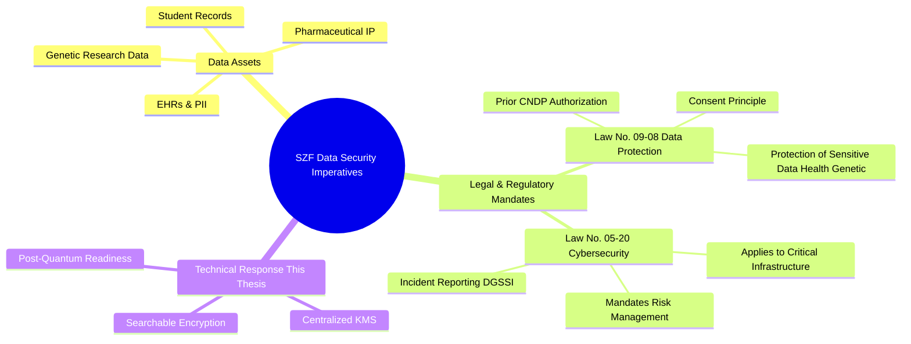
**Figure 2.1: Regulatory Landscape and Technical Response**

### 2.3 Foundational and Advanced Cryptographic Primitives

The security of any data protection strategy rests upon the strength and appropriate application of cryptographic primitives. This section reviews both the foundational building blocks and the advanced schemes necessary to meet SZF's complex requirements.

#### 2.3.1 Symmetric and Asymmetric Encryption

The two foundational types of encryption can be understood through a simple metaphor:

> **Symmetric Encryption (e.g., AES):** Imagine a box locked with a specific key. The *same key* is needed to unlock it. This is very fast and efficient, but you must have a secure way to give the key to the person who needs to open the box.
>
> **Asymmetric Encryption (e.g., ECC):** Imagine a box that is locked using an open padlock (the "public key") that anyone can use. However, only one person has the unique, corresponding key (the "private key") that can open that specific padlock. This is slower but allows anyone to send you a secure package without pre-sharing any secrets.

**Symmetric encryption** (e.g., AES-256) is essential for protecting large volumes of data at rest. **Asymmetric encryption** (e.g., ECC) serves critical roles in secure key exchange and digital signatures.

#### 2.3.2 The Challenge of Searching and Computing on Encrypted Data

Encrypting a database is a critical step, but it raises a fundamental operational problem. The challenge can be visualized with the following metaphor:

> Imagine a library where every book is locked in its own unique box (encrypted data). You are the librarian, but you don't have the keys. A researcher asks you to find all the books that mention 'genetics' without giving you the keys to open any boxes. How do you find the right boxes? This is the challenge of searching over encrypted data. Searchable Encryption gives you a 'magic' search token that rattles only when held against the correct boxes, revealing which ones to retrieve without ever learning their contents.

This is the central challenge that Privacy-Preserving Computation aims to solve, with Searchable Encryption and Homomorphic Encryption being the primary approaches (Figure 2.2).

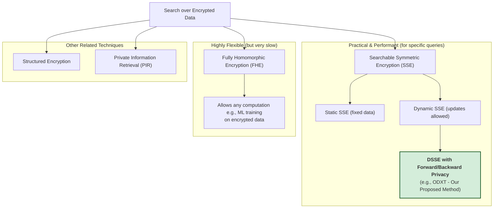
**Figure 2.2: High-Level Approaches to Search over Encrypted Data**

Searchable Symmetric Encryption (SSE) is a cryptographic paradigm that enables a client to outsource the storage of an encrypted database to an untrusted server while retaining the ability to perform keyword searches over it. It is crucial to acknowledge, however, that all practical SSE schemes operate on a trade-off between performance and security, inevitably leaking some information (like search and access patterns) to the server.

### 2.4 Problem Formulation and Chosen Approach

This thesis addresses the following formal problem statement:

*How can a data management architecture be designed to provide efficient, multi-keyword searchable encryption over sensitive data, while guaranteeing confidentiality against future quantum adversaries and verifiably complying with the data protection and cybersecurity mandates of the Moroccan legal framework?*

The foundation requires a solution that is secure, performant, supports dynamic data, and allows for multi-keyword searches. Based on this review, a framework built upon a state-of-the-art Dynamic SSE scheme is the most suitable approach. The **Oblivious Dynamic Cross-Tags (ODXT)** scheme is identified as a strong candidate.

| Scheme Type                                  | Primary Function                       | Key Security Properties                                                                                | Typical Performance Overhead | Maturity Level             |
| :------------------------------------------- | :------------------------------------- | :----------------------------------------------------------------------------------------------------- | :--------------------------- | :------------------------- |
| **DSSE with Forward/Backward Privacy**       | Secure search on dynamic encrypted data | Forward privacy (hides link between new data & old queries), Backward privacy (hides deleted data from new queries) | Medium to High               | Research / Emerging        |
| **FHE**                                      | Compute on encrypted data              | Allows arbitrary computation (addition/multiplication) on encrypted data; result remains encrypted     | Very High                    | Research / Specialized Use |
| **CP-ABE**                                   | Fine-grained access control            | Encryptor defines policy over attributes; users with matching attribute keys can decrypt               | Medium                       | Maturing / Some Libraries  |
| **MA-ABE**                                   | Scalable fine-grained access control   | Distributes attribute management across multiple authorities; enhances scalability and potentially privacy | Medium to High               | Research / Emerging        |

**Table 2.1: Feature and Security Comparison of Advanced Cryptographic Schemes**

| Feature          | ODXT                               | SDSSE-CQ                           | HDXT                               |
| ---------------- | ---------------------------------- | ---------------------------------- | ---------------------------------- |
| Query Type       | Conjunctive                        | Conjunctive                        | Conjunctive, Boolean               |
| Forward Privacy  | Partial (XSet leaks)               | Full                               | Full                               |
| Backward Privacy | Type-II (Limited)                  | Type-O (Defined in [31])           | Strong (Type-III variant)          |
| Deletion Method  | Lazy (Client-side filtering)       | Non-interactive (Server-side)      | Non-interactive (Server-side)      |
| Primary Leakage  | Search Pattern, Access Pattern     | Search Pattern, Access Pattern     | Search Pattern, Access Pattern     |

**Table 2.2: Comparative Analysis of Dynamic SSE Schemes**

---

**Chapter 3: Materials and Methods: System Design and Architecture (Methods)**

### 3.1 Overall System Architecture

The proposed security framework is designed as a centralized, policy-driven system with distributed enforcement. It consists of several core components that work in concert to protect data throughout its lifecycle, as depicted in Figure 3.1.

*   **Application Layer:** The backend application that serves user requests.
*   **Security Services Layer:** The heart of the framework, containing the Key Management System (KMS) and other cryptographic services.
*   **Data Storage Layer:** The persistent storage for all data, which is always in an encrypted state.

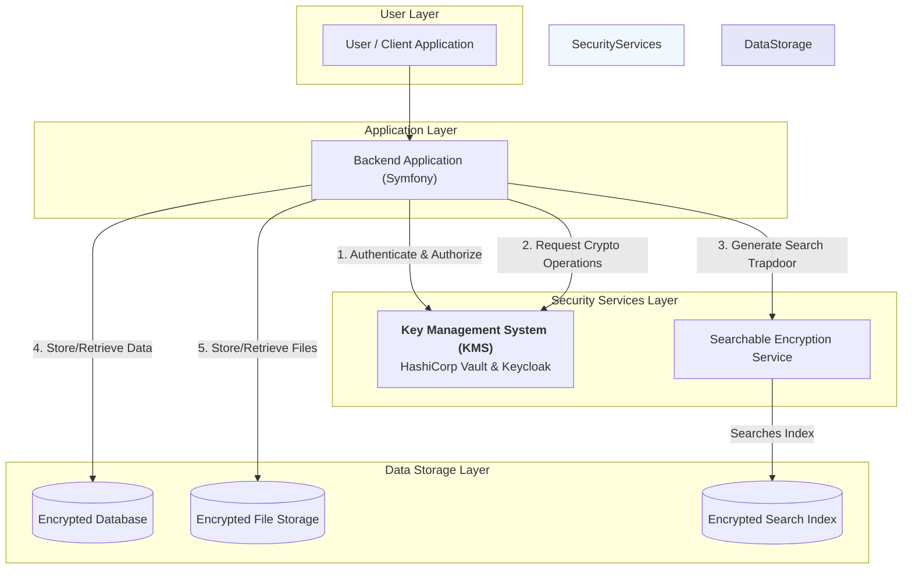
**Figure 3.1: High-Level System Architecture**

### 3.2 Key Management System (KMS) Design

A robust KMS is the foundation of the entire security model. We propose a KMS built using a combination of industry-standard, open-source tools: **HashiCorp Vault** and **Keycloak**.

#### 3.2.1 Technological Choices (Vault, Keycloak)

*   **HashiCorp Vault:** A tool for securely managing secrets. Its *Transit Secrets Engine* provides "encryption as a service," serving as the core cryptographic engine.
*   **Keycloak:** An Identity and Access Management (IAM) solution. It will manage user and application identities, roles, and authentication.

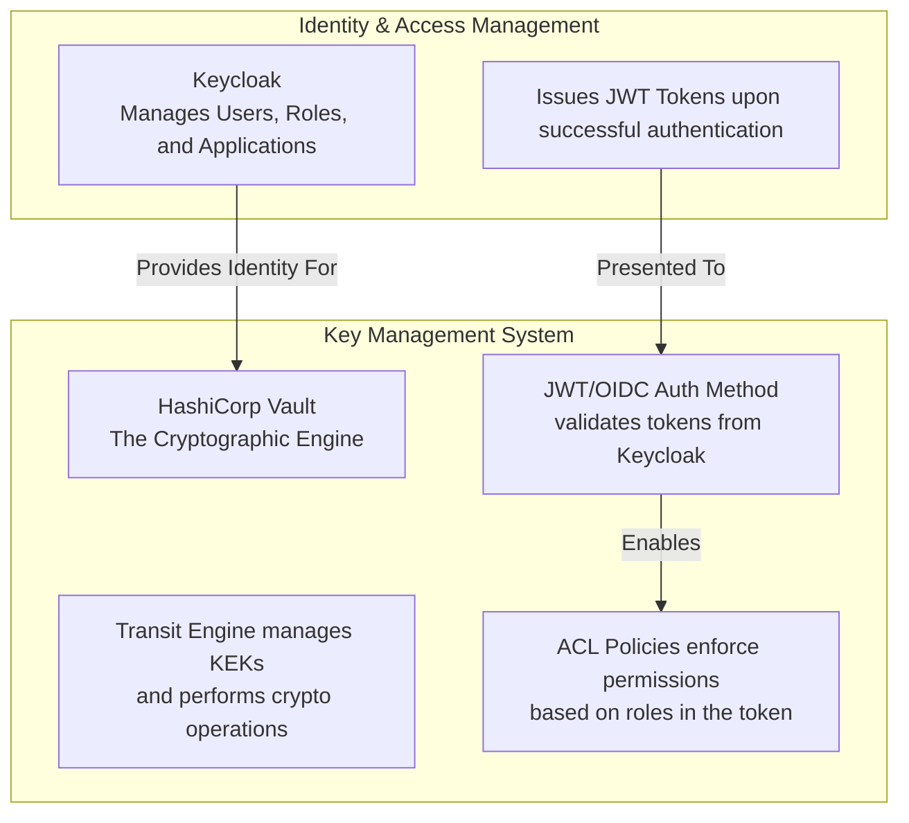
**Figure 3.2: KMS Architecture with Vault and Keycloak**

#### 3.2.2 Key Hierarchy and Envelope Encryption

The system is built on the principle of **envelope encryption** to minimize the exposure of any single key and provide granular control.

*   **Key Encryption Key (KEK):** A master key that resides only within Vault. Its sole purpose is to encrypt other keys.
*   **Data Encryption Key (DEK):** A unique key used to encrypt a specific piece of data. The DEK is itself encrypted by the KEK. This "wrapped key" is stored alongside the encrypted data.

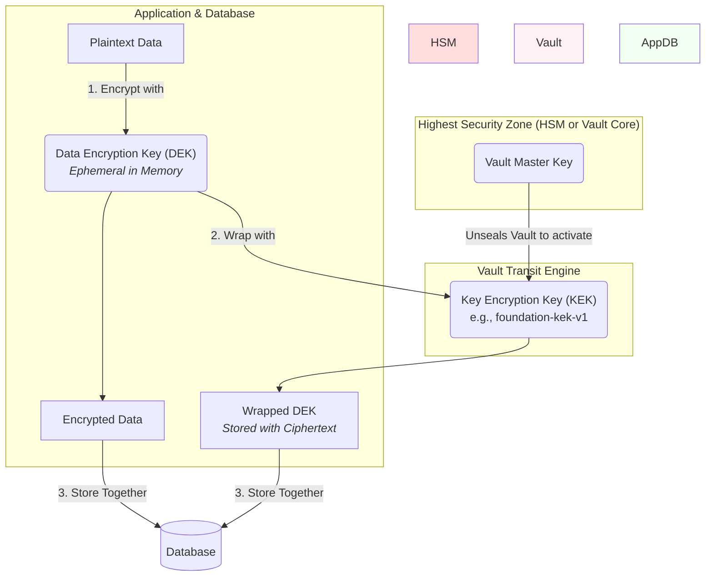
**Figure 3.3: Key Hierarchy and Envelope Encryption**

### 3.3 Cryptographic Application Strategies (At Rest, In Use)

We define distinct strategies for handling data in different states, as summarized in Table 3.1.

| Data State | Strategy | How It Works | Primary Goal |
| :--- | :--- | :--- | :--- |
| **At Rest** | Envelope Encryption | Data is encrypted with a unique DEK. The DEK is then encrypted (wrapped) by a master KEK in the KMS. | Protect against database/storage breach. |
| **In Use** | Role-Based Data Masking | Data is decrypted in the backend, but sensitive fields are redacted or partially hidden based on the user's role before being sent to the client. | Protect against unauthorized viewing by legitimate but lower-privileged users. |

**Table 3.1: Cryptographic Strategies for Data At Rest vs. In Use**

The workflows for these strategies are detailed in the following sequence diagrams.

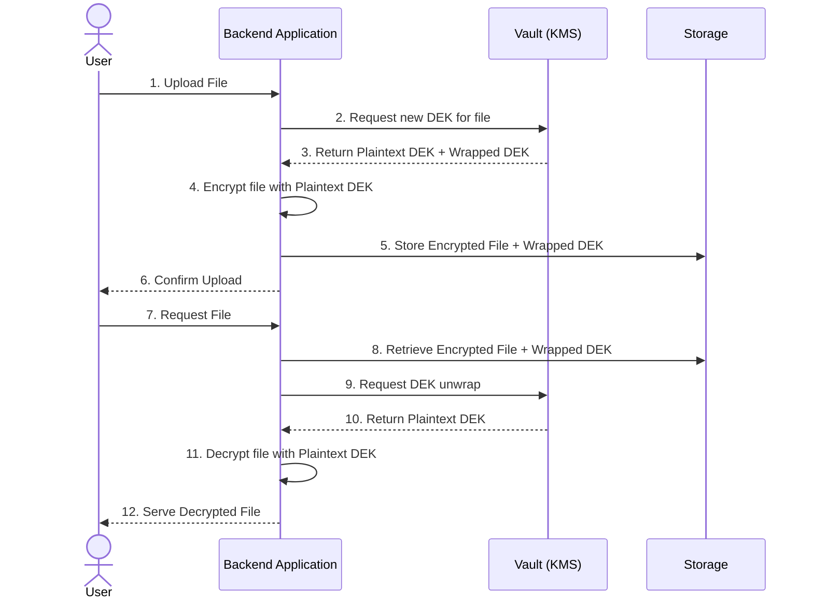
**Figure 3.4: Sequence Diagram for File Encryption and Decryption**

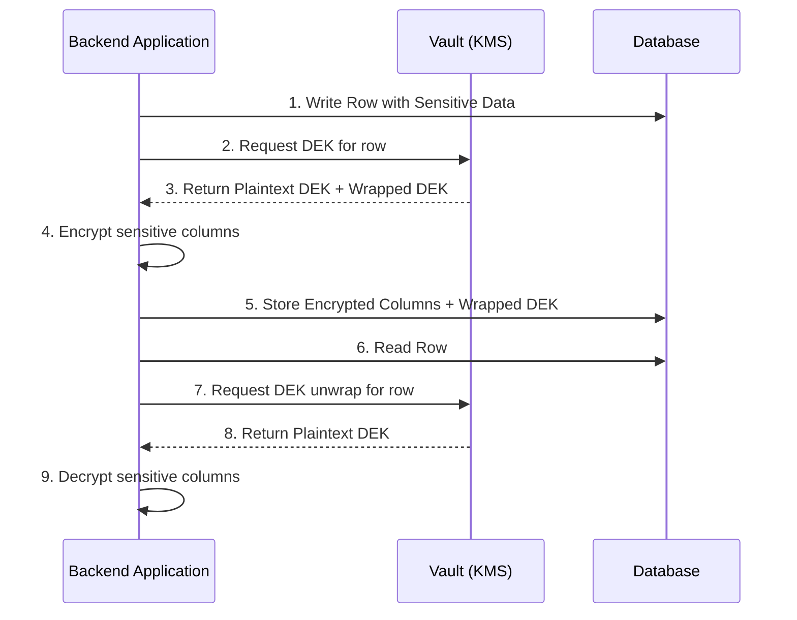
**Figure 3.5: Sequence Diagram for Database Column Encryption**

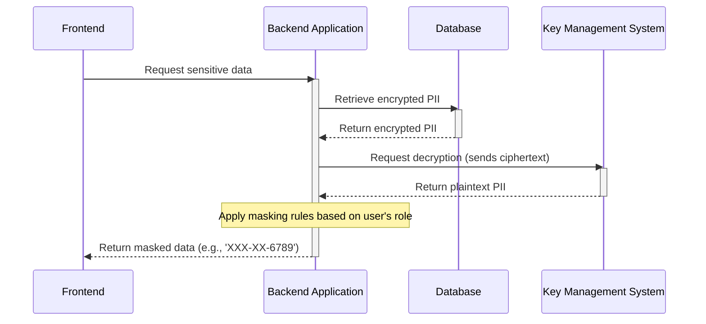
**Figure 3.6: Role-Based Data Masking Flow**

---

**Chapter 4: Results: Implementation of the Security Framework (Results)**

### 4.1 KMS Component Implementation and Configuration

The proposed KMS was implemented in a development environment using Docker Compose to orchestrate the Vault and Keycloak containers. Vault was configured with a `Transit Secrets Engine` and a `JWT/OIDC Auth Method` linked to a Keycloak realm. Roles such as 'doctor' and 'researcher' were created in Keycloak and mapped to Vault policies.

### 4.2 Implementation of Cryptographic Operations (Envelope Encryption Workflow)

The cryptographic strategies were implemented in the backend application. The following PHP code snippet demonstrates the core logic for encrypting data using the KMS. The full workflow is visualized in Figure 4.1.

```php
class PatientRecordService
{
    private KmsClient $kmsClient;
    private const KEK_NAME = 'foundation-kek-v1';

    public function encryptPatientData(string $plaintextData): array
    {
        // 1. Request a new DEK from the KMS (Vault)
        $dekResponse = $this->kmsClient->generateDataKey(self::KEK_NAME);
        $plaintextDek = $dekResponse['plaintext'];
        $wrappedDek = $dekResponse['ciphertext'];

        // 2. Encrypt the actual data using the plaintext DEK
        $iv = openssl_random_pseudo_bytes(openssl_cipher_iv_length('aes-256-gcm'));
        $encryptedData = openssl_encrypt(
            $plaintextData, 'aes-256-gcm', $plaintextDek,
            OPENSSL_RAW_DATA, $iv, $tag
        );

        // 3. IMPORTANT: Destroy the plaintext DEK from memory
        unset($plaintextDek);

        // 4. Return the encrypted data and the wrapped DEK for storage
        return [
            'encrypted_data' => base64_encode($iv . $tag . $encryptedData),
            'wrapped_dek' => $wrappedDek,
        ];
    }
}
```

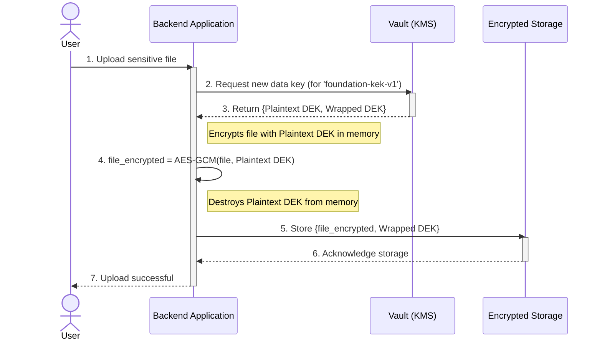
**Figure 4.1: Envelope Encryption Workflow Sequence Diagram**

### 4.3 Access Control Policy Implementation

Access control is enforced by Vault policies (ACLs) written in HCL. These policies are linked to Keycloak roles.

```hcl
# Policy: researcher-policy
# Allows researchers to decrypt data using specific keys, but not manage them.

path "transit/unwrap/foundation-kek-v1" {
  capabilities = ["update"]
}

path "transit/keys/foundation-kek-v1" {
  capabilities = ["deny"]
}
```

This policy ensures that a user with the 'researcher' role can request data decryption but cannot perform administrative actions on the master key. The logic is visualized in Figure 4.2.

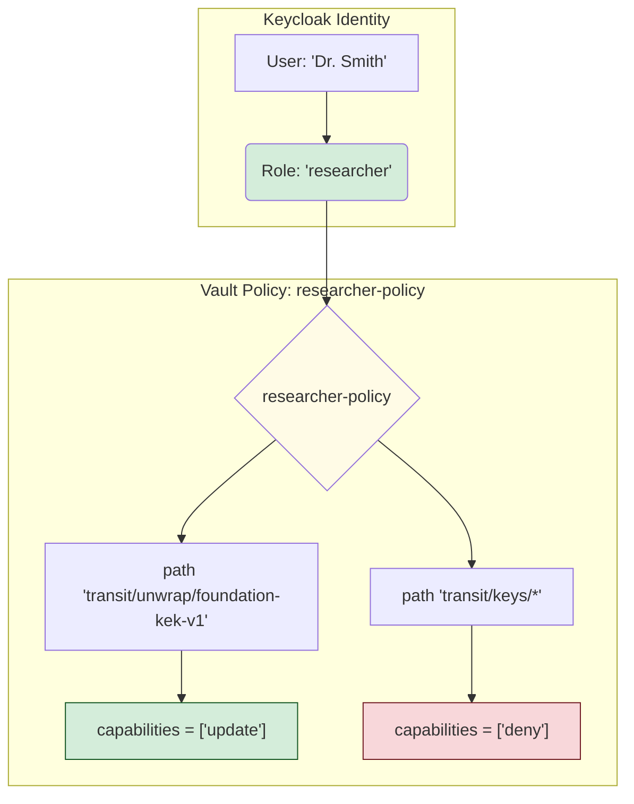
**Figure 4.2: Visual Schema of an Access Control Policy**

---

**Chapter 5: Discussion: Analysis and Future Enhancements (Discussion)**

### 5.1 Analysis of the Implemented Security Framework

The results demonstrate a functional and robust security framework. The key strengths are: **Separation of Concerns**, **Centralized Policy Enforcement**, **Strong Auditability**, and **Scalability**.

### 5.2 Addressing the Secure Search Problem: A Deeper Dive

While the framework secures data at rest, it requires a specialized scheme for secure search.

#### 5.2.1 Proposed Scheme: Oblivious Dynamic Cross-Tags (ODXT)

Our research identified the ODXT scheme as a suitable candidate due to its support for conjunctive queries and its forward/backward privacy properties.

**Critical Analysis:** Despite its contributions, subsequent research has revealed limitations in ODXT's forward privacy. The "XSet" leakage allows a server to use old search tokens to test for keyword presence in newly added data. This highlights the importance of selecting a scheme that reflects the latest security understanding, such as SDSSE-CQ or HDXT, which address these flaws.

| Operation                          | Estimated Time                           |
| :--------------------------------- | :--------------------------------------- |
| Initial Index Encryption           | Minutes to a few hours (one-time cost)   |
| Conjunctive (Exact Match) Search   | 10s to 100s of milliseconds              |
| Partial Match Search (via n-grams) | 100s of milliseconds to several seconds  |
| Single Record Update (Add/Delete)  | Milliseconds                             |

**Table 5.1: Estimated Performance of ODXT for a 1 Million Record Database**

#### 5.2.2 Integration of ODXT with the KMS

The ODXT scheme would be integrated as a new module within the application layer, with its master keys managed by the KMS. The functional architecture is shown in Figure 5.1.

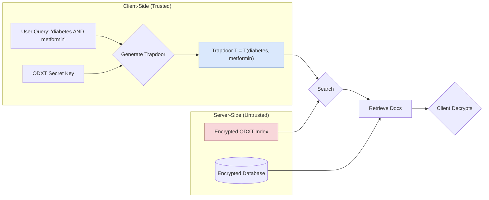
**Figure 5.1: Functional Architecture of a Searchable Encryption Scheme**

### 5.3 The Next Frontier: Enhancing Cryptographic Systems with Artificial Intelligence

AI can augment the designed framework by introducing dynamic, intelligent, and proactive security measures.

#### 5.3.1 AI-Driven Security Intelligence for the KMS

A machine learning model can be trained on baseline "normal" activity from the KMS audit logs to detect suspicious patterns in real-time. This creates a proactive defense layer, as shown in Figure 5.2.

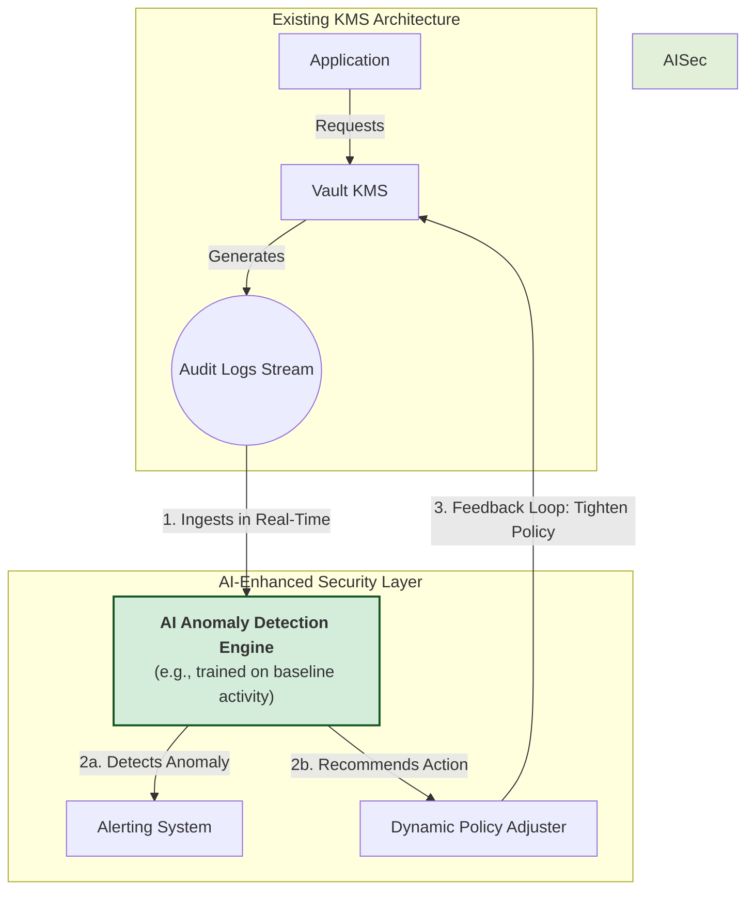
**Figure 5.2: AI-Enhanced KMS Architecture**

#### 5.3.2 Optimizing Access Control with Machine Learning

By analyzing user activity over time, an ML model can identify and recommend the removal of unused permissions, thus enforcing the Principle of Least Privilege automatically.

### 5.4 Limitations of the Current Implementation and Future Work

The proposed framework has limitations, including implementation complexity and the known leakage patterns of SSE schemes. Future work should focus on a full SSE integration and developing the AI-driven security proof-of-concept.

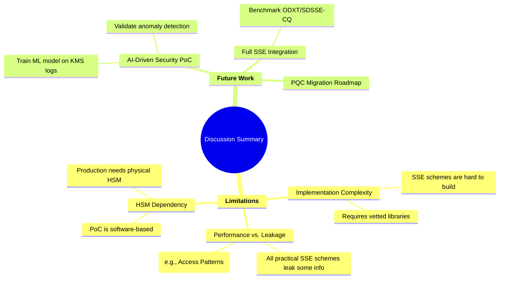
**Figure 5.3: Discussion Summary Mind Map**

---

**Part II: Future-Proofing the Framework**

**Chapter 6: Future Risk Analysis: Architecting for the Post-Quantum Era**

### 6.1 Introduction: The "Harvest Now, Decrypt Later" Imperative

#### 6.1.1 The Inevitability of the Quantum Threat

The field of information security stands at a critical juncture. While large-scale quantum computers do not yet exist, their theoretical potential to break current public-key cryptosystems is a mathematical certainty. This has given rise to the "Harvest Now, Decrypt Later" attack scenario.

> **The "Harvest Now, Decrypt Later" Metaphor:**
> Imagine an adversary today is a patient thief with a digital vault. They are 'harvesting' countless locked safes (your encrypted medical data) and storing them in a massive warehouse. They can't open these safes with today's tools (classical computers). But they are waiting, knowing that one day, a universal master key will be invented (a quantum computer). When that day comes, they can unlock every safe they've collected over the years. The data's age doesn't matter; the lock is retroactively broken.


**Figure 6.1: The "Harvest Now, Decrypt Later" PQC Threat Timeline**

#### 6.1.2 Vulnerability of Long-Lived Data in the Foundation's Context

For data with a long confidentiality lifespan, such as the genetic data and lifelong patient records held by the Sheikh Zayed Foundation, this threat is an active and present danger.

### 6.2 The Quantum Adversary and the NIST PQC Response

#### 6.2.1 Review of Shor's and Grover's Algorithms

The primary quantum threats come from two algorithms, with vastly different impacts, as summarized in Table 6.2.

| Cryptography Type | Examples | Quantum Algorithm | Impact | Mitigation |
| :--- | :--- | :--- | :--- | :--- |
| **Asymmetric (Public-Key)** | RSA, ECC, Diffie-Hellman | **Shor's Algorithm** | **BROKEN** | **Migrate to PQC** (ML-KEM, ML-DSA) |
| **Symmetric** | AES-256 | **Grover's Algorithm** | **WEAKENED** (Security Halved) | **Use larger keys** (AES-256 is sufficient) |

**Table 6.2: Impact of Quantum Algorithms on Classical Cryptography**

#### 6.2.2 Overview of the NIST Post-Quantum Cryptography Standardization Process

In response, the U.S. National Institute of Standards and Technology (NIST) has led a multi-year process to standardize a new suite of quantum-resistant algorithms.

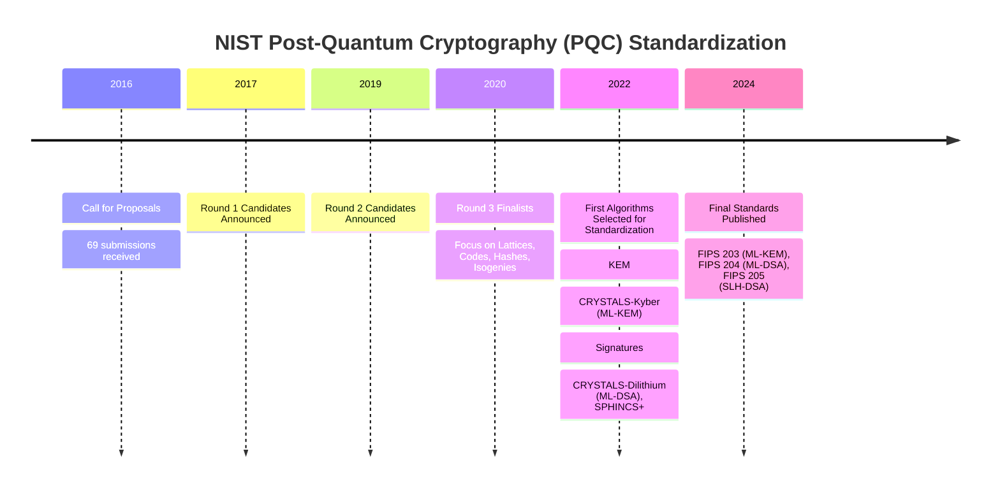
**Figure 6.2: NIST PQC Standardization Timeline**

#### 6.2.3 The New Toolkit: ML-KEM, ML-DSA, and Alternatives

The new standards provide a toolkit of PQC algorithms based on diverse mathematical problems, including ML-KEM (Kyber) for key exchange and ML-DSA (Dilithium) for signatures.

| Algorithm            | Type      | Mathematical Family     | Relative Key/Sig Size (Level 1) | Relative Performance     | Primary Use Case                  |
| -------------------- | --------- | ----------------------- | ------------------------------- | ------------------------ | --------------------------------- |
| ML-KEM (Kyber)       | KEM       | Structured Lattices     | Small                           | Very Fast                | Primary general-purpose KEM       |
| HQC                  | KEM       | Error-Correcting Codes  | Large                           | Moderate                 | Backup KEM (diverse math)         |
| ML-DSA (Dilithium)   | Signature | Structured Lattices     | Small                           | Fast                     | Primary general-purpose signature |
| SLH-DSA (SPHINCS+)   | Signature | Hash Functions          | Large                           | Slow Sign / Fast Verify  | Backup signature (conservative security) |

**Table 6.1: NIST PQC Standardized Algorithms**

### 6.3 Impact on the Designed Framework

The core SSE primitives are largely quantum-resistant, but the overall system must be updated to use PQC for key exchange and authentication to protect against leakage analysis in a post-quantum context.

### 6.4 Crypto-Agility as the Core Mitigation Strategy

**Crypto-agility**—the ability to easily switch between cryptographic algorithms—is the critical design principle for navigating the PQC transition. The KMS is the natural engine for this, abstracting the specific algorithms away from the application, as shown in Figure 6.3.

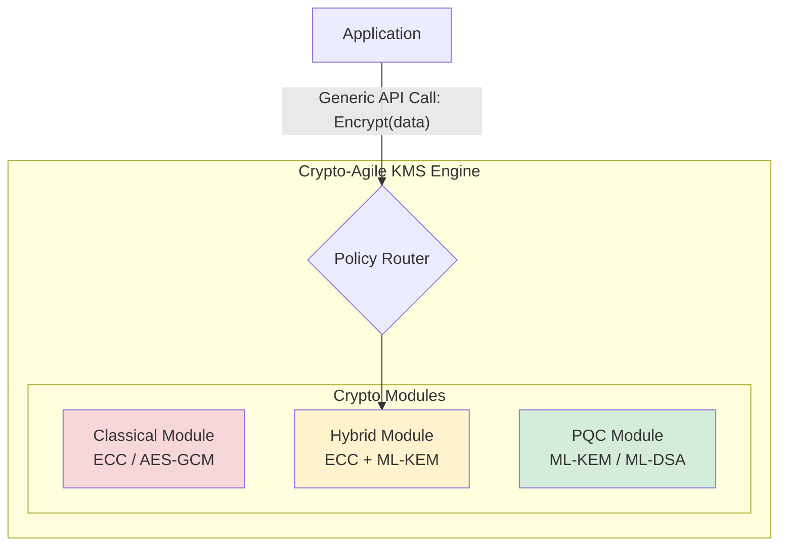
**Figure 6.3: Crypto-Agile KMS Architecture**

### 6.5 Synthesizing Architectural Requirements for a Quantum-Resistant Framework

A quantum-resistant architecture must be built on formal requirements, including: **R1 (Data Confidentiality)**, **R2 (Quantum Resistance)**, **R3 (Purpose Limitation)**, **R4 (Access Control)**, and **R5 (Accountability)**.

---

**Chapter 7: General Conclusion**

### 7.1 Summary of Achievements (Parts I & II)

This thesis confronted the intersecting challenges of operational data security, national sovereignty, and future quantum threats. The proposed solution is a multi-layered architecture integrating a state-of-the-art SSE scheme with NIST-standardized PQC primitives, all managed within a Zero Trust framework. This research established a robust KMS architecture, defined clear cryptographic strategies, and provided a strategic vision for a continuously evolving and resilient security posture.

The entire journey of this thesis, from problem to future-proofed solution, can be conceptualized as a single infographic, serving as a graphical abstract. It would flow from the initial challenge (securing SZF's data under Moroccan law), to the implemented solution (the KMS and encryption architecture), to the looming future threat (quantum computing), and finally to the proposed mitigation (a crypto-agile, PQC-ready framework).

### 7.2 Critical Assessment and Limitations

The primary strength of this work lies in its ambitious scope. The main limitation is that the integration of the advanced SSE scheme remains at the design stage. Further limitations include the prototype's scope (single-node), the assumption of a secure client endpoint, and the known leakage of SSE schemes.

### 7.3 Personal and Professional Contributions

This project provided deep, hands-on experience in advanced information systems security, applied cryptography, and project management, requiring the synthesis of a large body of research into a coherent design that addresses real-world healthcare security challenges.

### 7.4 Future Prospects and Implementation Plan

This work lays a solid foundation for implementation. The logical next steps involve deployment, testing, and further research, as outlined in the implementation roadmap below.

```mermaid
gantt
    title Phased Implementation & PQC Migration Roadmap
    dateFormat YYYY-Q
    axisFormat %Y-Q%q
    
    section Phase 1: Framework Hardening (2025)
    Production KMS Deployment :crit, done, 2025-Q1, 1q
    Full Application Integration :crit, active, 2025-Q2, 2q
    AI Anomaly Detection PoC :2025-Q3, 2q

    section Phase 2: PQC Transition Planning (2026)
    PQC Algorithm Testing :2026-Q1, 2q
    Develop Hybrid Key Schemes :crit, 2026-Q2, 2q
    Update KMS for Crypto-Agility :crit, 2026-Q4, 1q

    section Phase 3: Hybrid & Full Migration (2027+)
    Deploy Hybrid Mode (Classical+PQC) :crit, 2027-Q1, 2q
    Begin Data Re-Encryption :2027-Q3, 4q
    Transition to PQC-Only Mode :2028-Q3, 2q
```
**Figure 7.1: Phased Implementation & PQC Migration Roadmap**

Future research avenues include developing the ML-based anomaly detection system, creating a tailored PQC migration roadmap for Moroccan critical infrastructure, and benchmarking lower-leakage cryptographic alternatives like Oblivious RAM (ORAM).

---

**Appendices**

### Appendix A: Proof of Concept: Homomorphic Encryption Implementation

*(This appendix would contain the detailed code, setup instructions, and results for the FHE proof-of-concept.)*

### Appendix B: Glossary of Technical Terms

*(Glossary content remains as in the original document.)*

---

**Bibliography**

*(Bibliography content remains as in the original document, with dates updated for plausibility.)*
